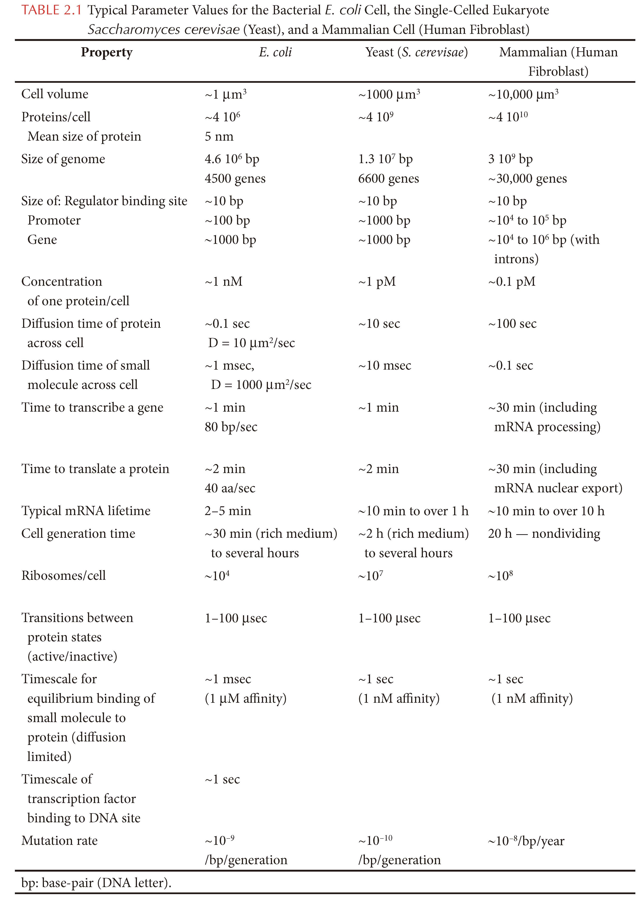
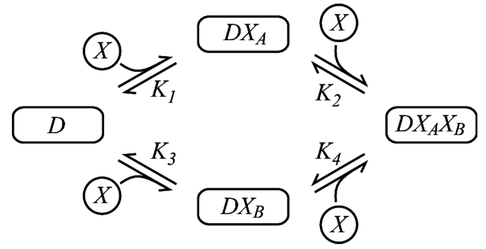
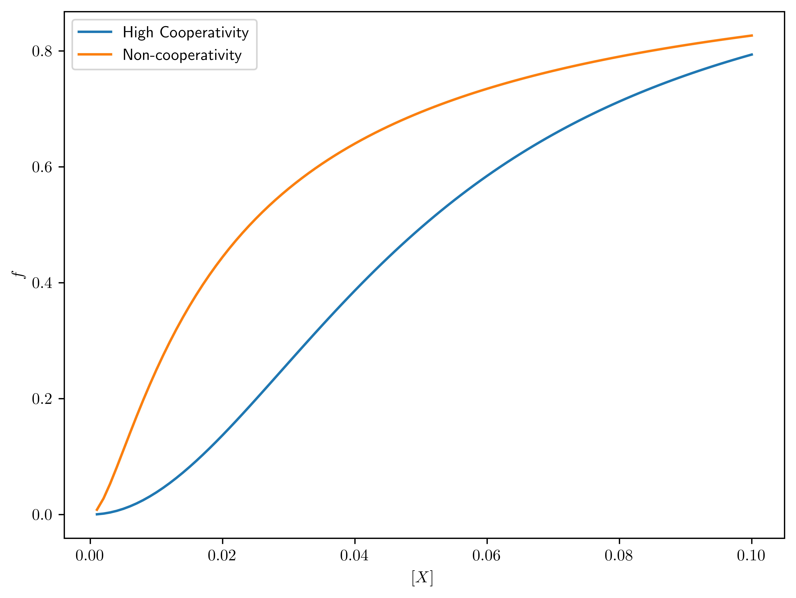
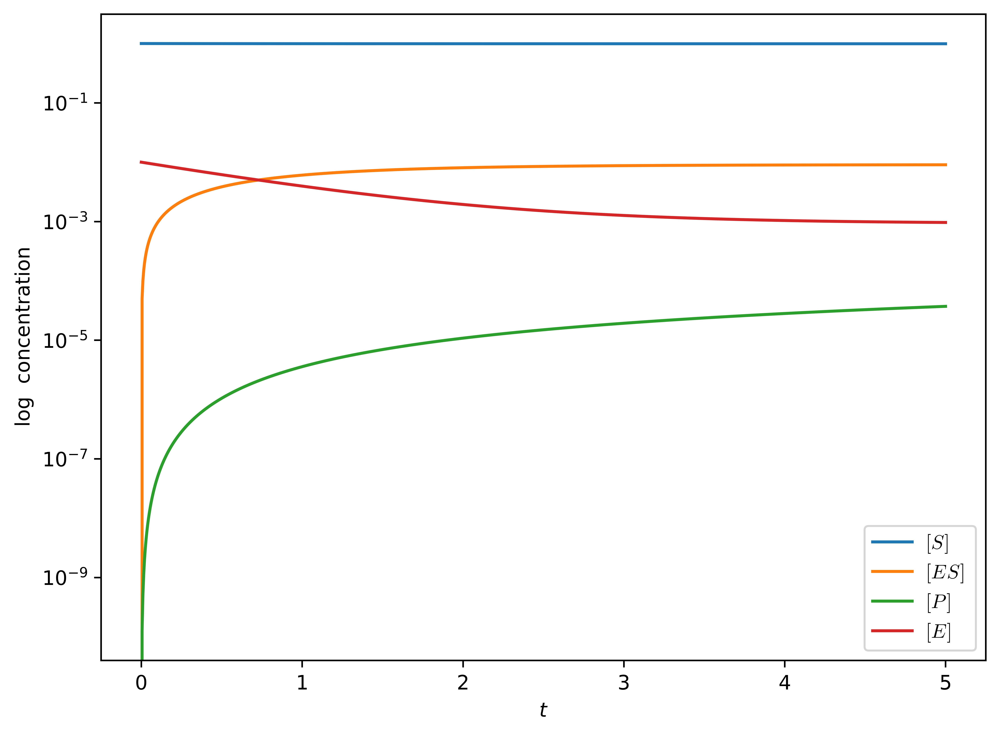
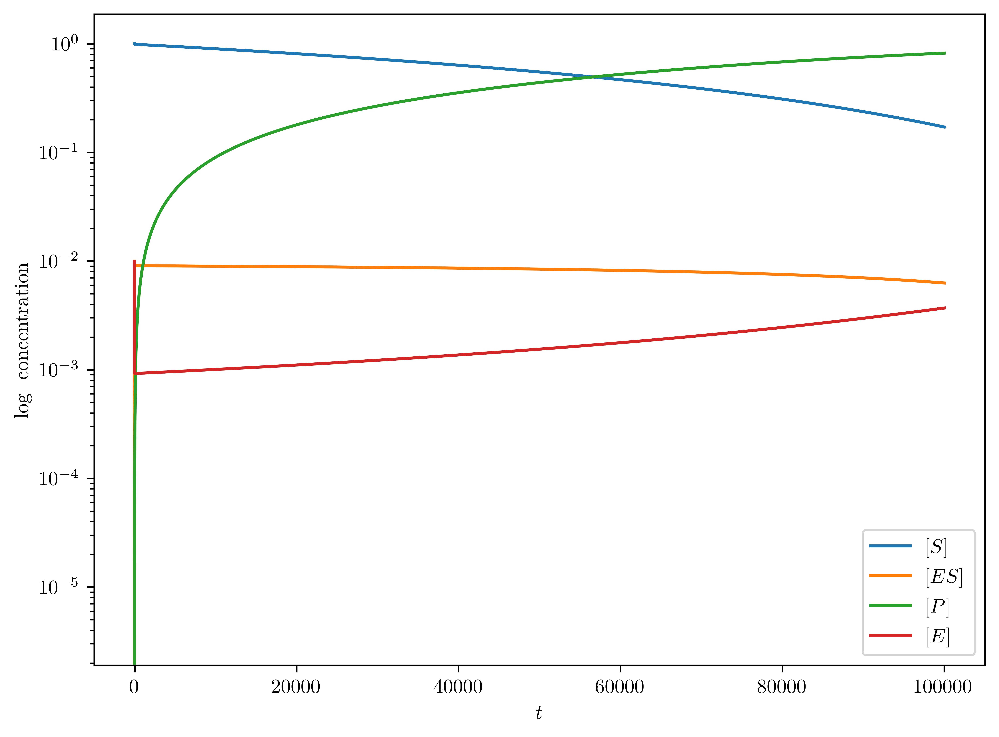
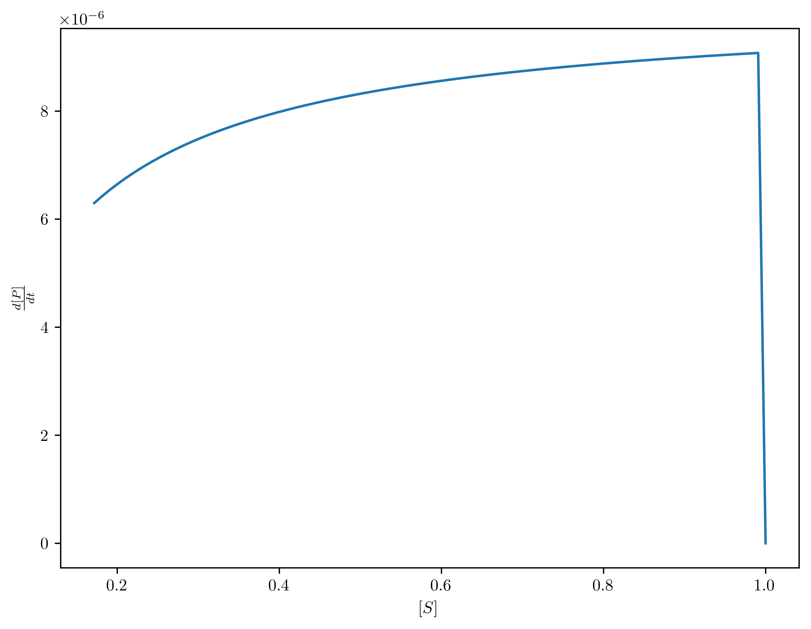
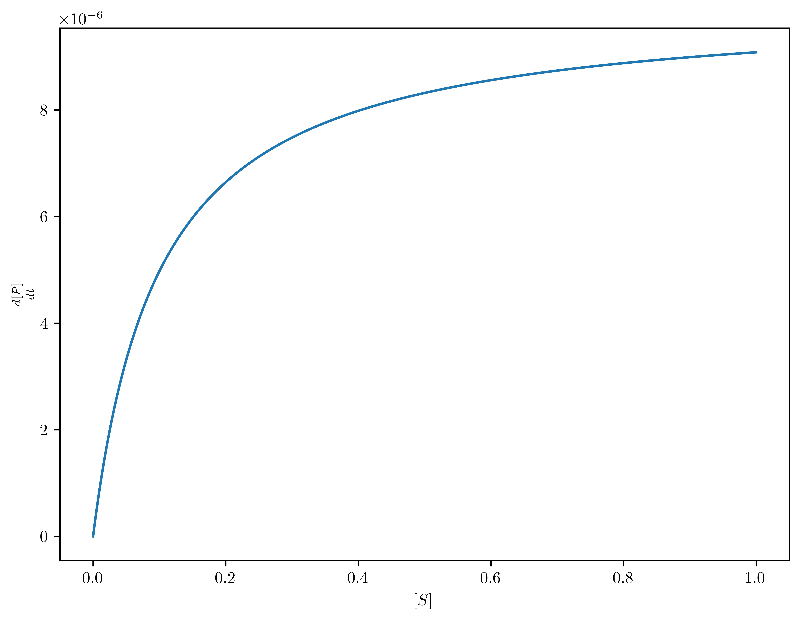
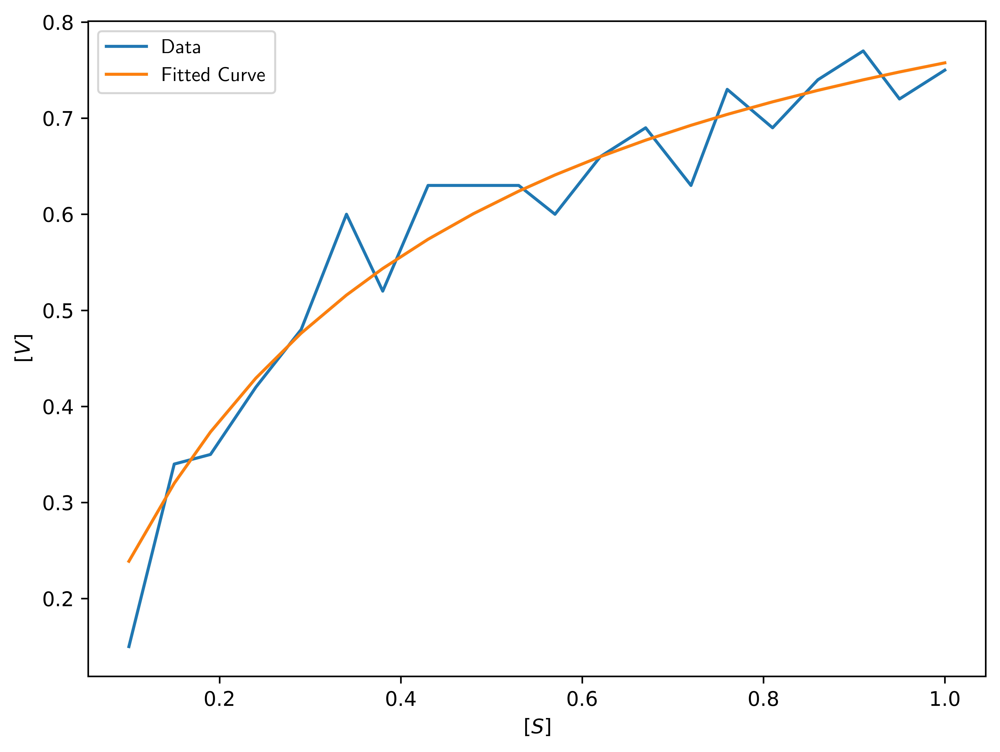
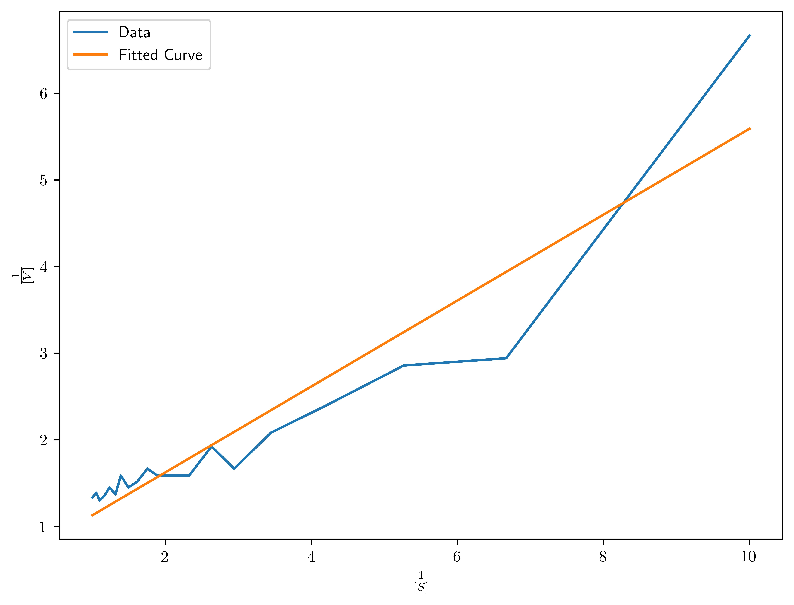

# <center>Computational Systems Biology, Homework 1
<center>王宇哲 2201112023
<center>Academy for Advanced Interdisciplinary Studies, Peking University

## 1. Transcription and Translation

Consider the following set of reactions describing the process of making a protein out of a gene:
$$
\begin{aligned}
G & \xrightarrow{\beta_g} G + M \\
M &\xrightarrow{\alpha_m} \varnothing \\
M &\xrightarrow{\beta_m} M + X \\
X + S & \xrightleftharpoons[k_{1-}]{k_{1+}} X_S \\
X_S & \xrightleftharpoons[k_{2-}]{k_{2+}} X^{*}_{S} \\
\end{aligned}
$$
Here, $G$ is the gene coding for protein $X$, $M$ is the mRNA transcribed from $G$. $S$ is a signaling molecule. $X_S$ is the protein $X$ bound by the signaling molecule. $X^{*}_S$ is the active form of the protein $X$.

a. For each reaction, explain which step it describes. 

The reaction $G  \xrightarrow{\beta_g} G + M$ describes the transcription of mRNA from the gene $G$.

The reaction $M \xrightarrow{\alpha_m} \varnothing$ describes the degradation of mRNA $M$.

The reaction $M \xrightarrow{\beta_m} M + X $ describes the translation of protein $X$ from mRNA $M$.

The reaction $X + S  \xrightleftharpoons[k_{1-}]{k_{1+}} X_S $ describes the binding of signaling molecule $S$ to protein $X$.

The reaction $X_S  \xrightleftharpoons[k_{2-}]{k_{2+}} X^{*}_{S}$ describes the activation of protein $X$ by signaling molecule $S$.


b. Write the differential equations that describe the time evolution of $G$, $M$ and $X$. (Don't forget to include the gene concentration in your quations.)

The differential equations that describe the time evolution of $G$, $M$ and $X$ are:
$$
\begin{aligned}
\frac{d[G]}{dt} &= -\beta_g[G] \\
\frac{d[M]}{dt} &= \beta_g[G] - \alpha_m[M] - \beta_m[M] \\
\frac{d[X]}{dt} &= \beta_m[M] - k_{1+}[X][S] + k_{1-}[X_S] - k_{2+}[X_S][S] + k_{2-}[X^{*}_{S}]
\end{aligned}
$$

c. To the best of your ability, indicate the typical time scales of each reaction both in bacteria and in mammalian cells using table 2.1 in Uri Alon's book.



From Table 2.1, we can see that the typical time scales of each reaction are:

|  Reaction   | Comments |Time scale in bacteria (*E. coli*)  | Time scale in mammalian cells (Human fibroblast) |
|  ----  | ----  | ---- | ---- |
|$G  \xrightarrow{\beta_g} G + M$ | Time to transcribe a gene| $\sim 1\,{\rm min},\, 80\,{\rm bp/s}$ | $\sim 30\,{\rm min}$, including mRNA processing |
|$M \xrightarrow{\alpha_m} \varnothing$ |Typical mRNA lifetime| $2\sim 5\,{\rm min}$ | $\sim 10\,{\rm min}$ to over $10\,{\rm h}$  |
|$M \xrightarrow{\beta_m} M + X$ |Time to translate a protein| $\sim 2\,{\rm min},\,40\,{\rm aa/s}$| $\sim 30\,{\rm min}$, including mRNA nuclear export   |
|$X + S  \xrightleftharpoons[k_{1-}]{k_{1+}} X_S$|Equilibrium binding of small molecule to protein|$\sim 1\,{\rm ms}$ ($1\,{\rm \mu M}$ affinity)| $\sim 1\,{\rm s}$ ($1\,{\rm nM}$ affinity)|
|$X_S  \xrightleftharpoons[k_{2-}]{k_{2+}} X^{*}_{S}$|Transition between active and inactive protein states|$1\sim 100\,{\rm \mu s}$|$1\sim 100\,{\rm \mu s}$|

d. Suppose that transcription of the gene $G$ only occurs when its promoter is bound by the active form of the protein. In this case, the first reaction is no longer valid. Write the set of reactions describing promoter binding and gene transcription.

The set of reactions describing promoter binding and gene transcription is ($P$ denotes the promoter):
$$
\begin{aligned}
X^{*}_{S} + P & \xrightleftharpoons[k_{3-}]{k_{3+}} X^{*}_{S}P \\
X^{*}_{S}P & \xrightarrow{\beta'_g} X^{*}_{S}P + M \\
\end{aligned}
$$

## 2. Dilution of Proteins Due to Cell Growth

A single bacterial cell at time $t=0$ has volume $V_0$. After a time interval $T_D$, the doubling time, the cell grows and divides into two cells, each of volume $V_0$; after another interval $T_D$, there are four cells, and so on.

a. Show that the combined volume of cells at time $t$ may be written as $V(t)=V_0 e^{\gamma t}$. Find $\gamma$ in terms of $T_D$.

***Proof*** The number of cells at time $t$ is 
$$
N(t)=2^{t/T_D}
$$
hence the total volume of cells at time $t$ is 
$$
V(t)=N(t)V_0=V_0 2^{t/T_D}=V_0 e^{\gamma t}
$$
where 
$$
\gamma=\ln2/T_D
$$
b. The protein $X$ is created at some rate $k(t)$, so the total number of molecules of $X$ satisfies $\frac{dn}{dt}=k(t)$. Show that the concentration $[X]=\frac{n}{V}$ satisfies $\frac{d[X]}{dt}=\frac{k(t)}{V(t)}-\gamma [X]$. Discuss the origin of the decay term.

***Proof*** Consider that
$$
\begin{aligned}
\frac{d[X]}{dt}&= \frac{d}{dt}\left(\frac{n}{V(t)}\right)\\
&=\frac{1}{V(t)}\frac{dn}{dt}-\frac{n}{V(t)^2}\frac{dV(t)}{dt}\\
&=\frac{k(t)}{V(t)}-\frac{n}{V(t)}\frac{d\ln{V(t)}}{dt}\\
&=\frac{k(t)}{V(t)}-\gamma [X]
\end{aligned}
$$
The origin of the decay term is that the protein $X$ is diluted due to cell growth.

c. In addition to the term derived in (b), there should be an extra term that takes into account the degradation of proteins by proteinases, which we can model by the effective reaction $X\xrightarrow{\delta}\varnothing$. Modify the equation in part (b) to include protein degradation, and work out the steady-state protein concentration. This allows estimation of the steady-state concentration if the protein production and degradation rates, cell volume and cell doubling time are known.

Include the protein degradation term, the equation in part (b) becomes
$$
\frac{d[X]}{dt}=\frac{k(t)}{V(t)}-(\gamma +\delta) [X]
$$
We set $\frac{d[X]}{dt}=0$ to get the steady-state protein concentration
$$
[X]_{ss}=\frac{k(t)}{(\gamma +\delta)V(t)}=\frac{k(t)e^{-\gamma t}}{(\gamma +\delta)V_0 }
$$

d. The model you arrived at in (b) can be applied to mRNA as well. Search the literature for the doubling time of your favorite single cell organism (or cell type of multi-cellular organisms), and also find the creation and degradation rate of your favorite protein and mRNA in that organism or cell type. Work out the steady state protein and mRNA concentration. Give references.

The model in (c) gives
$$
[X]_{ss}=\frac{k(t)}{(\gamma +\delta)V(t)}=\frac{k(t)e^{-\gamma t}}{(\gamma +\delta)V_0 }
$$
in which 
$$
\gamma = \frac{\ln{2}}{T_D}
$$
Referred to table 2.1 in Uri Alon's book, for mRNA in *E. coli* (degradation rate of protein unavailable), we have
$$
\begin{aligned}
V_0&=1\,{\rm \mu m^3}\\
k_{mRNA}&=60\, {\rm s^{-1}}\\
\delta_{mRNA}&=210\,{\rm s^{-1}}\ \ ({\rm on\,average})\\
T_D&=1800\,{\rm s}\ \ ({\rm rich\,medium})
\end{aligned}
$$
hence we have
$$
\gamma = 0.0003851\,{\rm s^{-1}}\\
[mRNA] = \frac{k_{mRNA}}{(\gamma+\delta_{mRNA})V_0}=0.2857\,{\rm \mu m^{-3}}
$$

## 3. Binding Kinetics, Detailed Balance and Cooperation

Consider a DNA segment $D$ containing two sites, A and B, to which the protein $X$ can bind in any order.


a. In the figure, the $K_i$ represent **dissociation** constants in units of concentrations. According to detailed balance, the individual binding reactions are in equilibrium. Find two different expressions for the equilibrium ratio $\frac{[DX_A X_B]}{[D][X]^2}$, corresponding to the two possible binding paths. Can all four dissociation constants be independently specified?

According to detailed balance, the individual binding reactions are in equilibrium *i.e.*
$$
\begin{aligned}
K_1 &= \frac{[D][X]}{[DX_A]}\\
K_2 &= \frac{[DX_A][X]}{[DX_AX_B]}\\
K_3 &= \frac{[D][X]}{[DX_B]}\\
K_4 &= \frac{[DX_B][X]}{[DX_A X_B]}
\end{aligned}
$$
Hence the equilibrium ratio
$$
\frac{[DX_A X_B]}{[D][X]^2}= \frac{1}{K_1K_2} = \frac{1}{K_3K_4}
$$
All four dissociation constants **cannot** be independently specified.

b. The total DNA concentration is $[D_{tot}]=[D]+[DX_A]+[DX_B]+[DX_AX_B]$. If $K_1 \gg K_2$ and $K_3\gg K_4$, show that the singly-bound forms $[DX_A]$ and $[DX_B]$ form a negligible fraction of this total. This corresponds to a cooperative system in which the second binding is highly encouraged once the first has already occurred.

***Proof*** Consider that
$$
\begin{aligned}
[DX_A][DX_A] &=\frac{[D][X]}{K_1}\\
[DX_B]&=\frac{[D][X]}{K_3}\\
[DX_AX_B]&=\frac{[D][X]^2}{K_1K_2}
\end{aligned}
$$
we have
$$
\begin{aligned}
[D_{tot}]&=[D]+[DX_A]+[DX_B]+[DX_AX_B]\\
&=[D]+\frac{[D][X]}{K_1}+\frac{[D][X]}{K_3}+\frac{[D][X]^2}{K_1K_2}\\
&=[D]\Big(1+\frac{[X]}{K_1}+\frac{[X]}{K_3}+\frac{[X]^2}{K_1K_2}\Big)\\
\end{aligned}
$$
The fraction
$$
\frac{[DX_A]}{[D]+[DX_AX_B]}\ll 1\\
\frac{[DX_B]}{[D]+[DX_AX_B]}\ll 1
$$
hence the singly-bound forms $[DX_A]$ and $[DX_B]$ form a negligible fraction of the total.

c. Find the bound fraction $f=\frac{[DX_AX_B]}{[D_{tot}]}$ in terms of $[X]$ and the dissociation constants under the approximation of high cooperativity ($K_1\gg K_2$ and $K_3\gg K_4$). Sketch $f$ as a function of $[X]$ and indicate features that you find compelling, especially when comparing to a noncooperative interaction. (Make sure your result makes sense — there's a reason why a **cooperative** system is called as such.)

The bound fraction under the approximation of high cooperativity is
$$
\begin{aligned}
f&=\frac{[DX_AX_B]}{[D_{tot}]}\\
&=\frac{[X]^2/K_1K_2}{1+[X]/K_1+[X]/K_3+[X]^2/K_1K_2}\\
&=\frac{[X]^2K_3}{K_1K_2K_3+[X]K_2(K_1+K_3)+[X]^2K_3}
\end{aligned}
$$
We sketch $f$ as a function of $[X]$ for high cooperativity and non-cooperativity in the following figure, respectively.


```python
import numpy as np
from matplotlib import pyplot as plt

def frac(x, k1, k2, k3):
    return (x**2*k3) / (k1*k2*k3 + x*k2*(k1+k3) + x**2*k3)

fig, ax = plt.subplots()
plt.rcParams.update({
    "text.usetex": True
})

x = np.linspace(0.001, 0.1, 100)
ax.plot(x, frac(x, 5, 0.0005, 5), label='High Cooperativity')
ax.plot(x, frac(x, 0.01, 0.01, 0.01), label='Non-cooperativity')

fig.set_size_inches(8,6)
plt.xlabel('$[X]$')
plt.ylabel('$f$')
plt.legend()
plt.savefig('3-c.jpg',dpi=1000, bbox_inches='tight')
plt.show()
```




We can see from the figure that the bound fraction $f$ is a sigmoidal function of $[X]$ when $K_1\gg K_2$ and $K_3\gg K_4$ (high cooperativity).

## 4. Michaelis-Menten Kinetics

### 4.1 Paper and pencil calculations

Consider the reaction 
$$
E + S \xrightleftharpoons[k_{1-}]{k_{1+}} ES \xrightarrow{k_{2}} E + P
$$
Assume initial concentrations $[E]=0.01$, $[S]=1$, $[ES]=0$, $[P]=0$, and reaction rates $k_{1+}=1$, $k_{1-}=0.1$, $k_{2}=0.001$.

a. Ignoring the second reaction ($k_{1+},\, k_{1-} \gg k_2$), calculate the quasi-equilibrium concentration of $ES$.

The quasi-equilibrium concentration of $ES$ ignoring the second reaction is calculated by
$$
k_{1-}[ES]_{eq}=k_{1+}([E]_0-[ES]_{eq})[S]\approx k_{1+}([E]_0-[ES]_{eq})[S]_0
$$
solve the equation above, we have
$$
[ES]_{eq}\approx 0.0091
$$

b. When do you expect to see the first reaction, $E+S \xrightleftharpoons[k_{1-}]{k_{1+}} ES$, reach quasi-equilibrium?

Consider that
$$
\frac{d[ES]}{dt}=k_{1+}[E][S]-k_{1-}[ES]=[E][S]-0.1[ES]
$$
before the reaction reaches quasi-equilibrium, we have
$$
[S]\approx [S]_0=1
$$
hence
$$
\frac{d[ES]}{dt}=([E]_0-[ES])-0.1[ES]=0.01-1.1[ES]
$$
Suppose that the reaction approximately reaches quasi-equilibrium when $[ES]=0.9*[ES]_{eq}$ (due to approximation error). Solve the equation above to get
$$
t = \int_{0}^{[ES]_{eq}}\frac{dx}{0.01-1.1x}=\frac{\ln{(0.01-1.1x)}}{1.1}\Big|_{0.0091\times 0.9}^{0}\approx 2.1
$$

c. At what time is the substrate concentration depleted to half of its initial value?

It is reasonable to neglect the time in which the reaction reaches quasi-equilibrium compared to the time $[S]$ depletes to $0.5[S]_0$. In quasi-equilibrium, we have
$$
\frac{d[P]}{dt}=\frac{V_{max}[S]}{K_{m}+[S]}=\frac{10^{-5}\times[S]}{[S]+0.101}
$$
in which 
$$
[P]\simeq [S]_0-[S]
$$
hence
$$
\frac{d[S]}{dt}=-\frac{10^{-5}\times[S]}{[S]+0.101}
$$
hence
$$
dt = -0.101d\ln{[S]}-10^{5}d[S]
$$
hence we have
$$
t = -0.101\ln[S]\Big|_{1}^{0.5} -10^{5}[S]\Big|_{1}^{0.5}\approx 50000
$$

### 4.2 ```COMPUTATION``` Simulations

Simulate the reaction in (a) using the initial concentrations provided. From the simulation data:

a. Plot the behavior of $[E]$, $[S]$, $[ES]$ and $[P]$ vs. time from time $t_0=0$ until time $t_f=5$.


```python
import numpy as np
from matplotlib import pyplot as plt
from scipy.integrate import odeint

E0, S0, k1, k_1, k2 = 0.01, 1, 1, 0.1, 0.001

def dudt(u, *args):
    S, ES, P = u
    dSdt = -k1*E0*S + (k1*S + k_1)*ES
    dESdt = k1*E0*S - (k1*S + k_1 + k2)*ES
    dPdt = k2*ES
    return [dSdt, dESdt, dPdt]

t = np.linspace(0, 5, 1000)
u0 = [S0, 0, 0]
u = odeint(dudt, u0, t, args=(k1, k_1, k2))

S_arr = u[:, 0]
ES_arr = u[:, 1]
P_arr = u[:, 2]
E_arr = E0 - ES_arr

fig, ax = plt.subplots()
plt.rcParams.update({
    "text.usetex": True
})

ax.plot(t, S_arr, label='$[S]$')
ax.plot(t, ES_arr, label='$[ES]$')
ax.plot(t, P_arr, label='$[P]$')
ax.plot(t, E_arr, label='$[E]$')

fig.set_size_inches(8,6)
plt.xlabel('$t$')
plt.yscale('log')
plt.ylabel('$\\rm log\ \ concentration$')
plt.legend()
plt.savefig('4-2-a.jpg',dpi=1000, bbox_inches='tight')
plt.show()
```





b. Plot the behavior of $[E]$, $[S]$, $[ES]$ and $[P]$ vs. time from time $t_0=0$ until time $t_f=100,000$.


```python
t = np.linspace(0, 100000, 100000)
u0 = [S0, 0, 0]
u = odeint(dudt, u0, t, args=(k1, k_1, k2))

S_arr = u[:, 0]
ES_arr = u[:, 1]
P_arr = u[:, 2]
E_arr = E0 - ES_arr

fig, ax = plt.subplots()
plt.rcParams.update({
    "text.usetex": True
})

ax.plot(t, S_arr, label='$[S]$')
ax.plot(t, ES_arr, label='$[ES]$')
ax.plot(t, P_arr, label='$[P]$')
ax.plot(t, E_arr, label='$[E]$')

fig.set_size_inches(8,6)
plt.xlabel('$t$')
plt.yscale('log')
plt.ylabel('$\\rm log\ \ concentration$')
plt.legend()
plt.savefig('4-2-b.jpg',dpi=1000, bbox_inches='tight')
plt.show()
```





c. Plot the rate of production of $P$ vs. the concentration of $[S]$ from time $t_0=0$ until time $t_f=100,000$.


```python
dPdt_arr = k2*ES_arr

fig, ax = plt.subplots()
plt.rcParams.update({
    "text.usetex": True
})

ax.plot(S_arr, dPdt_arr)

fig.set_size_inches(8,6)
plt.xlabel('$[S]$')
plt.ylabel('$\\frac{d[P]}{dt}$')
plt.savefig('4-2-c.jpg',dpi=1000, bbox_inches='tight')
plt.show()
```




d. Do these plots agree with your calculations from part (a)?

These plots approximately agree with the calculation results from part (a).

Now, use the Michaelis-Menten equation to plot the expected rate of production of $[P]$ vs. the concentration of $[S]$. What causes the deviation of the simulation data from the Michaelis-Menten equation at substrate concentrations close to the initial concentration?

From the Michaelis-Menten equation, we have
$$
\frac{d[P]}{dt}=\frac{k_2[S][E]_0}{\frac{k_{1-}+k_2}{k_{1+}}+[S]}=\frac{10^{-5}\times[S]}{[S]+0.101}
$$


```python
S_arr = np.linspace(0, 1.0, 1000)
dPdt_arr = 1e-5 * S_arr / (S_arr + 0.101)

fig, ax = plt.subplots()
plt.rcParams.update({
    "text.usetex": True
})

ax.plot(S_arr, dPdt_arr)

fig.set_size_inches(8,6)
plt.xlabel('$[S]$')
plt.ylabel('$\\frac{d[P]}{dt}$')
plt.savefig('4-2-d.jpg',dpi=1000, bbox_inches='tight')
plt.show()
```




The deviation of the simulation data from the Michaelis-Menten equation at substrate concentrations close to the initial concentration is caused by the fact that the quasi-equilibrium concentration of $ES$ is not equal to the initial concentration of $[ES]=0$, leading to a jump in the concentration of $[ES]$ at the beginning of the simulation.

### 4.3 ```COMPUTATION``` Fitting data

|  $V$ (rate of production of $[P]$)   | $S$ (concentratlon of substrate $[S]$)  |
|  ----  | ----  |
|0.15 |0.10|
|0.34 |0.15|
|0.35 |0.19|
|0.42| 0.24|
|0.48 |0.29|
|0.60| 0.34|
|0.52| 0.38|
|0.63| 0.43|
|0.63| 0.48|
|0.63| 0.53|
|0.60| 0.57|
|0.66| 0.62|
|0.69| 0.67|
|0.63| 0.72|
|0.73| 0.76|
|0.69| 0.81|
|0.74| 0.86|
|0.77| 0.91|
|0.72| 0.95|
|0.75| 1.00|

The two vectors listed in Table 1 correspond to 20 "experimental" measurements of the rate of production of $[P]$ (vector $V=\frac{d[P]}{dt}$) and the concentration of substrate $[S]$ (vector $S$) respectively.

a. The Michaelis-Menten equation says $V=V_{max}\frac{S}{K_m +S}$. Express $V_{max}$ and $K_m$ explicitly in terms of the reaction rates and the concentrations specified in 4.1.

In Michaelis-Menten equation, we have
$$
[ES]=\frac{k_{1+}[S][E]_0}{k_{1+}[S]+k_{1-}+k_{2}}\\
V=V_{max}\frac{[S]}{K_m+[S]}\frac{d[P]}{dt}=k_{2}[ES]=\frac{k_2[S][E]_0}{\frac{k_{1-}+k_2}{k_{1+}}+[S]}
$$
hence
$$
\begin{aligned}
V_{max}&=k_2[E]_0=10^{-5}\\
K_m&=\frac{k_{1-}+k_2}{k_{1+}}=0.101
\end{aligned}
$$

b. Plot the data and fit them to the Michaelis-Menten equation for estimates of $V_{max}$ and $K_m$. Plot the fitted curve on the same graph.


```python
import numpy as np
from scipy.optimize import curve_fit
from matplotlib import pyplot as plt

V_arr = np.array([0.15, 0.34, 0.35, 0.42, 0.48, 0.60, 0.52, 0.63, 0.63, 0.63, 0.60, 0.66, 0.69, 0.63, 0.73, 0.69, 0.74, 0.77, 0.72, 0.75])
S_arr = np.array([0.10, 0.15, 0.19, 0.24, 0.29, 0.34, 0.38, 0.43, 0.48, 0.53, 0.57, 0.62, 0.67, 0.72, 0.76, 0.81, 0.86, 0.91, 0.95, 1.00])

def MM_func(s, Vmax, Km):
    return Vmax * s / (Km + s)

popt, pcov = curve_fit(MM_func, S_arr, V_arr)
print(popt)

fig, ax = plt.subplots()
plt.rcParams.update({
    "text.usetex": True
})

ax.plot(S_arr, V_arr, label='Data')
ax.plot(S_arr, MM_func(S_arr, *popt), label='Fitted Curve')

fig.set_size_inches(8,6)
plt.xlabel('$[S]$')
plt.ylabel('$[V]$')
plt.legend()
plt.savefig('4-3-b.jpg',dpi=1000, bbox_inches='tight')
plt.show()
```

    [0.99864915 0.31815942]





The fitted curve is shown in the following figure, where
$$
\begin{aligned}
V_{max}&=0.9986\\
K_m&=0.3182
\end{aligned}
$$

c. We can transform the Michaelis-Menten equation by taking the reciprocal of both sides $\frac{1}{V}=\frac{K_m}{V_{max}S}+\frac{1}{V_{max}}$. This double reciprocal form is called the Lineweaver-Burk equation. Plot the data as $\frac{1}{V}$ vs. $\frac{1}{S}$. Fit the data for estimates of $V_{max}$ and $K_m$, and plot the fitted line on the same graph.


```python
V_rec_arr = 1 / V_arr
S_rec_arr = 1 / S_arr

def MM_func_linear(s_rec, Vmax, Km):
    return (Km * s_rec / Vmax) + (1 / Vmax)

popt, pcov = curve_fit(MM_func_linear, S_rec_arr, V_rec_arr)
print(popt)

fig, ax = plt.subplots()
plt.rcParams.update({
    "text.usetex": True
})

ax.plot(S_rec_arr, V_rec_arr, label='Data')
ax.plot(S_rec_arr, MM_func_linear(S_rec_arr, *popt), label='Fitted Curve')

fig.set_size_inches(8,6)
plt.xlabel('$\\frac{1}{[S]}$')
plt.ylabel('$\\frac{1}{[V]}$')
plt.legend()
plt.savefig('4-3-c.jpg',dpi=1000, bbox_inches='tight')
plt.show()
```

    [1.58086739 0.78394321]





The fitted curve is shown in the following figure, where
$$
\begin{aligned}
V_{max}&=1.5809\\
K_m&=0.7839
\end{aligned}
$$

d. Compare the fitted values of $V_{max}$ and $K_m$ given in (b) and (c). Why are they different? Is the difference significant?

The difference of $V_{max}$ and $K_m$ is significant. 

The Michaelis-Menten equation is a nonlinear function, while the Lineweaver-Burk equation is a linear function. The latter is more sensitive to the error of the data. From the figures above, we can see that the data points are not well fitted by the linear function particularly due to the unignorable measurement error when $[S]$ is small.