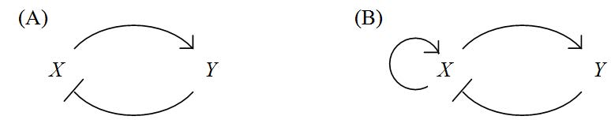

# <center>Computational Systems Biology, Homework 2
<center>王宇哲 2201112023
<center>Academy for Advanced Interdisciplinary Studies, Peking University

## 1. Competitive and uncompetitive inhibition

a. Reversible enzyme inhibitors can bind enzymes reversibly, and slowing down or halting enzymatic reactions. If an inhibitor occupies the active site of an enzyme and prevents binding of the substrate to the enzyme, we call it a competitive inhibitor. In the presence of a *competitive* inhibitor, the Michaelis-Menten equation becomes
$$
V_0=\frac{V_{max}S_0}{\alpha K_M+S_0}
$$
What is $\alpha$ in terms of $K_I$ and $I_0$? How does a competitive inhibitor affect the maximal turnover rate and the substrate concentration at which half that rate is reached? (Begin with a definition of total enzyme as $[E]_{tot}=[E]+[ES]+[EI]$ and use the derivation of the Michaelis-Menten equation as a guide. Assume $S_0,\, I_0\gg [E]_{tot}$).


***Proof.*** Consider the reactions
$$
\begin{aligned}
E+S&\xrightleftharpoons[k_{-1}]{k_1}ES\xrightarrow{k_2}E+P\\
E+I&\xrightleftharpoons{K_I}EI
\end{aligned}
$$
we have
$$
K_I=\frac{[E][I]}{[EI]}
$$
hence
$$
[EI]=\frac{[E][I]}{K_I}\simeq \frac{I_0[E]}{K_I}
$$
from quasi-steady state approximation, we have
$$
\frac{d[ES]}{dt}\simeq k_1S_0[E]-(k_{-1}+k_2)[ES]=0
$$
hence
$$
[E]=\frac{k_{-1}+k_2}{k_1S_0}[ES]=\frac{K_M}{S_0}[ES]
$$
consider that 
$$
\begin{aligned}
E_0&=[E]+[ES]+[EI]\\
&=\frac{K_M}{S_0}[ES]+[ES]+\frac{I_0}{K_I}\frac{K_M}{S_0}[ES]\\
&=[ES]\frac{(1+I_0/K_I)K_M+S_0}{S_0}
\end{aligned}
$$
hence
$$
\begin{aligned}
V_0&=k_2[ES]\\
&=\frac{k_2S_0E_0}{(1+I_0/K_I)K_M+S_0}\\
&\equiv \frac{V_{max}S_0}{\alpha K_M+S_0}
\end{aligned}
$$
where
$$
V_{max}=k_2E_0\\
\alpha=1+\frac{I_0}{K_I}
$$
let $[S]\rightarrow\infty$, the maximum turnover rate
$$
V'_{max}=V_{max}
$$
The substrate concentration $[S]$ at which half that rate is reached is 
$$\alpha K_M$$
Hence the maximal turnover rate $V'_{max}$ is unchanged, while substrate concentration at which half that rate is reached is increased by a factor of $\alpha$ under the presence of a competitive inhibitor.

b. Unlike a competitive inhibitor, an uncompetitive inhibitor binds only to the Enzyme-Substrate $(ES)$ complex, at a site distinct from the substrate active site. In the presence of an uncompetitive inhibitor, the Michaelis-Menten equation is altered to
$$
V_0=\frac{V_{max}S_0}{K_M+\beta S_0}
$$
What is $\beta$ in terms of $K'_I$ and $I_0$? How does a competitive inhibitor affect the maximal turnover rate and the substrate concentration at which half that rate is reached?


***Proof.*** Consider the reactions
$$
\begin{aligned}
E+S&\xrightleftharpoons[k_{-1}]{k_1}ES\xrightarrow{k_2}E+P\\
ES+I&\xrightleftharpoons{K'_I}ESI
\end{aligned}
$$
we have
$$
[ESI]=\frac{[ES][I]}{K'_I}\simeq \frac{I_0}{K'_I}[ES]
$$
from quasi-steady state approximation, we have
$$
\frac{d[ES]}{dt}\simeq k_1S_0[E]-(k_{-1}+k_2)[ES]=0
$$
hence
$$
[E]=\frac{k_{-1}+k_2}{k_1S_0}[ES]=\frac{K_M}{S_0}[ES]
$$
consider that
$$
\begin{aligned}
E_0&=[E]+[ES]+[ESI]\\
&=\frac{K_M}{S_0}[ES]+[ES]+\frac{I_0}{K'_I}[ES]\\
&=[ES]\frac{K_M+(1+I_0/K'_I)S_0}{S_0}
\end{aligned}
$$
hence
$$
\begin{aligned}
V_0&=k_2[ES]\\
&=\frac{k_2S_0E_0}{K_M+(1+I_0/K'_I)S_0}\\
&\equiv \frac{V_{max}S_0}{K_M+\beta S_0}
\end{aligned}
$$
where
$$
V_{max}=k_2E_0\\
\beta=1+\frac{I_0}{K'_I}
$$
let $[S]\rightarrow\infty$, the maximum turnover rate
$$
V'_{max}=\frac{V_{max}}{\beta}
$$
The substrate concentration $[S]$ at which half that rate is reached is 
$$
\frac{K_M}{\beta}
$$
Hence the maximal turnover rate $V'_{max}$ and substrate concentration at which half that rate are decreased by a factor of $\beta$ under the presence of an uncompetitive inhibitor.

c. A *mixed* inhibitor binds at a site distinct from the substrate active site, but it binds to either $ES$ or the enzyme by itself. Assume detailed balance for the reversible reactions. How is the Michaelis-Menten equation modified in the presence of a mixed inhibitor?


***Proof.*** A mixed inhibitor behaves as a combination of a competitive and an uncompetitive inhibitor. Assume detailed balance for the reversible reactions, The Michaelis-Menten equation is modified to (detailed derivation is omitted)
$$
V_0=\frac{V_{max}S_0}{\alpha K_M+\beta S_0}
$$
where
$$
V_{max}=k_2E_0\\
\alpha=1+\frac{I_0}{K_I}\\
\beta=1+\frac{I_0}{K'_I}
$$
let $[S]\rightarrow\infty$, the maximum turnover rate
$$
V'_{max}=\frac{V_{max}}{\beta}
$$
The substrate concentration $[S]$ at which half that rate is reached is 
$$
\frac{\alpha K_M}{\beta}
$$
Hence the maximal turnover rate $V'_{max}$ and substrate concentration at which half that rate are decreased by a factor of $\beta$ under the presence of a mixed inhibitor.

d. From an inspection of the curves below, determine the nature of the inhibition by acetazolamide on the carbonic anhydrase reaction, $H_2CO_3\rightleftharpoons H_2O+CO_2$.


***Proof.*** From the curves above, we can see that $V'_{max}$ is decreased in the presence of acetazolamide. The substrate concentration at which half that rate is reached is increased in the presence of acetazolamide. Hence acetazolamide is a mixed inhibitor.

## 2. Stability analysis of dynamical systems

a. For each of the following 1D dynamical systems, identify the fixed points and use a graphical argument ($f(x)=\frac{dx}{dt}$ vs. $x$) to determine the stability. In addition, plot the potential function $V(x)$($f(x)=-\frac{dV}{dx}$). $r$ can be positive, zero or negative. Discuss all three scenarios.

a-1. $\frac{dx}{dt}=rx-x^2$

***Proof.*** We let $f(x)=0$ to obtain the fixed points $x=0$ and $x=r$ (two fixed points overlap when $r=0$). We plot $\frac{dx}{dt}$ vs. $x$ for three senarios $r=0$, $r>0$ and $r<0$ (we take $r=0,\pm1$ for illustration) in the figure below.


```python
import numpy as np
from matplotlib import pyplot as plt

def f(x, r):
    return r*x - x**2

fig, ax = plt.subplots()
plt.rcParams.update({
    "text.usetex": True
})

x = np.linspace(-1.5, 1.5, 1000)
ax.plot(x, f(x, r=0), label='$r=0$')
ax.plot(x, f(x, r=1), label='$r>0$')
ax.plot(x, f(x, r=-1), label='$r<0$')
ax.axhline(0, linestyle='--', label='$f(x)=0$')

fig.set_size_inches(8,6)
plt.xlabel('$x$')
plt.ylabel('$f(x)$')
plt.legend()
plt.savefig('2-a-1-1.jpg',dpi=1000, bbox_inches='tight')
plt.show()
```


We can see from above that (N/A denotes non-existence)

|  | $x=0$ | $x=r$ |
| ---- | ---- | ---- |
|$r=0$|Unstable|N/A|
|$r>0$|Unstable|Stable|
|$r<0$|Stable|Unstable|

Consider the potential function 
$$
V(x)=-\frac{1}{2}rx^2+\frac{1}{3}x^3
$$
We plot $V(x)$ vs. $x$ in the figure below.


```python
def V(x, r):
    return -r*x**2/2 + x**3/3

fig, ax = plt.subplots()
plt.rcParams.update({
    "text.usetex": True
})

x = np.linspace(-1.5, 1.5, 1000)
ax.plot(x, V(x, r=0), label='$r=0$')
ax.plot(x, V(x, r=1), label='$r>0$')
ax.plot(x, V(x, r=-1), label='$r<0$')

fig.set_size_inches(8,6)
plt.xlabel('$x$')
plt.ylabel('$V(x)$')
plt.legend()
plt.savefig('2-a-1-2.jpg',dpi=1000, bbox_inches='tight')
plt.show()
```


a-2. $\frac{dx}{dt}=rx-x^3$

***Proof.*** Similar to a-1, we first plot $\frac{dx}{dt}$ vs. $x$ for three senarios $r=0$, $r>0$ and $r<0$ (we take $r=0,\pm1$ for illustration) in the figure below.


```python
def f(x, r):
    return r*x - x**3

fig, ax = plt.subplots()
plt.rcParams.update({
    "text.usetex": True
})

x = np.linspace(-1.5, 1.5, 1000)
ax.plot(x, f(x, r=0), label='$r=0$')
ax.plot(x, f(x, r=1), label='$r>0$')
ax.plot(x, f(x, r=-1), label='$r<0$')
ax.axhline(0, linestyle='--', label='$f(x)=0$')

fig.set_size_inches(8,6)
plt.xlabel('$x$')
plt.ylabel('$f(x)$')
plt.legend()
plt.savefig('2-a-2-1.jpg',dpi=1000, bbox_inches='tight')
plt.show()
```


We conclude the fixed points and their stability as follows (N/A denotes non-existence).

|  | $x=0$ | $x=\sqrt{r}$ | $x=-\sqrt{r}$ |
| ---- | ---- | ---- | ---- |
|$r=0$|Stable| N/A| N/A|
|$r>0$|Unstable | Stable|Stable|
|$r<0$|Stable|N/A|N/A|

Consider the potential function
$$
V(x)=-\frac{1}{2}rx^2+\frac{1}{4}x^4
$$
We plot $V(x)$ vs. $x$ in the figure below.


```python
def V(x, r):
    return -r*x**2/2 + x**4/4

fig, ax = plt.subplots()
plt.rcParams.update({
    "text.usetex": True
})

x = np.linspace(-1.5, 1.5, 1000)
ax.plot(x, V(x, r=0), label='$r=0$')
ax.plot(x, V(x, r=1), label='$r>0$')
ax.plot(x, V(x, r=-1), label='$r<0$')

fig.set_size_inches(8,6)
plt.xlabel('$x$')
plt.ylabel('$V(x)$')
plt.legend()
plt.savefig('2-a-2-2.jpg',dpi=1000, bbox_inches='tight')
plt.show()
```


b. (Strogatz 6.4) Consider the following 2D dynamical systems (two species competing for the same limited resource, for example, "rabbits" vs. "sheep"), where $x,y\succeq 0$. Find the fixed points, investigate their stability, draw the nullclines, and sketch plausible phase portraits. Indicate the basins of attraction of any stable fixed points.

b-1. $\frac{dx}{dt}=x(3-x-y),\ \ \frac{dy}{dt}=y(2-x-y)$

***Proof.*** We let $x(3-x-y)=0$, $y(2-x-y)=0$ to obtain the fixed points $(0,0)$, $(3,0)$ and $(0,2)$. Let $\frac{dx}{dt}=0$ to obtain the $x$-nullclines $y=3-x$ and $x=0$. Let $\frac{dy}{dt}=0$ to obtain the $y$-nullclines $y=2-x$ and $y=0$. We plot the nullclines and the fixed points in the figure below.


```python
def dx_dt(x, y):
    return x * (3 - x - y)

def dy_dt(x, y):
    return y * (2 - x - y)

fig, ax = plt.subplots()
plt.rcParams.update({
    "text.usetex": True
})

x_min, x_max, y_min, y_max = 0, 3.5, 0, 2.5
x_vals, y_vals = np.linspace(x_min, x_max, 20), np.linspace(y_min, y_max, 20)
X, Y = np.meshgrid(x_vals, y_vals)

DX, DY = dx_dt(X, Y), dy_dt(X, Y)
norm = np.sqrt(DX**2 + DY**2)

fig.set_size_inches(8,6)
ax.streamplot(X, Y, DX, DY, color=norm, linewidth=0.75, density=1.5)
ax.plot(x_vals, 3-x_vals, label='$x-{\\rm nullcline}$')
ax.plot(y_vals, 2-y_vals, label='$y-{\\rm nullcline}$')
ax.axvline(0, color='tab:blue')
ax.axhline(0, color='tab:orange')
ax.scatter(np.array([0, 3, 0]), np.array([0, 0, 2]), color='tab:red', label='$\\rm fixed\, points$',zorder=2)

cbar = fig.colorbar(ax.collections[0])
ax.set_xlim(x_min-0.1, x_max+0.1)
ax.set_ylim(y_min-0.1, y_max+0.1)

plt.xlabel('$x$')
plt.ylabel('$y$')
plt.legend()
plt.savefig('2-b-1.jpg',dpi=1000, bbox_inches='tight')
plt.show()
```


We can see from above that $(3,0)$ is a stable fixed point, $(0,0)$ and $(0,2)$ are unstable fixed points. The basin of attraction of $(3,0)$ is the whole plane of $x,y\succeq 0$.

b-2. $\frac{dx}{dt}=x(3-2x-y),\ \ \frac{dy}{dt}=y(2-x-y)$

***Proof.*** Similar to b-1, the fixed points are $(0,0)$, $(0,2)$, $(1.5,0)$ and $(1,1)$. The $x$-nullclines are $x=0$ and $y=3-2x$. The $y$-nullclines are $y=0$ and $y=2-x$. We plot the nullclines and the fixed points in the figure below.


```python
def dx_dt(x, y):
    return x * (3 - 2*x - y)

def dy_dt(x, y):
    return y * (2 - x - y)

fig, ax = plt.subplots()
plt.rcParams.update({
    "text.usetex": True
})

x_min, x_max, y_min, y_max = 0, 2, 0, 2.5
x_vals, y_vals = np.linspace(x_min, x_max, 20), np.linspace(y_min, y_max, 20)
X, Y = np.meshgrid(x_vals, y_vals)

DX, DY = dx_dt(X, Y), dy_dt(X, Y)
norm = np.sqrt(DX**2 + DY**2)

fig.set_size_inches(8,6)
ax.streamplot(X, Y, DX, DY, color=norm, linewidth=0.75, density=1.5)
ax.plot(x_vals, 3-2*x_vals, label='$x-{\\rm nullcline}$')
ax.plot(y_vals, 2-y_vals, label='$y-{\\rm nullcline}$')
ax.axvline(0, color='tab:blue')
ax.axhline(0, color='tab:orange')
ax.scatter(np.array([0, 0, 1.5, 1]), np.array([0, 2, 0, 1]), color='tab:red', label='$\\rm fixed\, points$',zorder=2)

cbar = fig.colorbar(ax.collections[0])
ax.set_xlim(x_min-0.1, x_max+0.1)
ax.set_ylim(y_min-0.1, y_max+0.1)

plt.xlabel('$x$')
plt.ylabel('$y$')
plt.legend()
plt.savefig('2-b-2.jpg',dpi=1000, bbox_inches='tight')
plt.show()
```


We can see from above that $(0,0)$, $(0,2)$ and $(1.5,0)$ are unstable fixed points, $(1,1)$ is a stable fixed point. The basin of attraction of $(1,1)$ is the whole plane of $x,y\succeq 0$.

## 3. Positive feedback and bistability

a. Suppose the protein $X$ is a transcriptional activator, and a promoter $D$ which is activated by the binding of $X$. If the downstream gene happens to code for $X$ itself, the resulting positive feedback can lead to bistability. We will consider an scenario such as that described in problem 3 of the first problem set in which there are two binding sites and binding is strongly cooperative.


a-1\. Let $v_1$ be the rate of expression from DNA bound by two $X$ molecules ($DX_AX_B$), and $v_0< v_1$ the rate of expression from free DNA ($D$) ; note that these rates of expression are assumed to have units of concentration per unit time. Use the results of problems 2 and 3 of the first problem set to show for an organism that grows at rate , where the degradation of $X$ is negligible compared to dilution, the time-evolution of the concentration $x\equiv [X]$ may be written in the form: $$\frac{dx}{dt}=\frac{v_0+v_1K_1K_2x^2}{1+K_1K_2x^2}-\gamma x$$ where $K_i\, (i=1,2)$ denote *association* constants. (Note that in the first problem set $K$ s stand for *dissociation* constants)

***Proof.*** Consider that the binding is strongly coopaerative, we ignore the intermediate states $DX_A$ and $DX_B$ and consider the reaction
$$
D+2X\xrightleftharpoons{K_1K_2} DX_AX_B\\
$$
hence we have
$$
K_1K_2=\frac{[DX_AX_B]}{[D][X]^2}=\frac{[DX_AX_B]}{[D]x^2}
$$
the increasing rate of $x$ due to the production of $X$ is
$$
\frac{[D]v_0+[DX_AX_B]v_1}{[D]_{tot}}=\frac{(v_0+v_1K_1K_2x^2)[D]}{[D]+[DX_AX_B]}=\frac{v_0+v_1K_1K_2x^2}{1+K_1K_2x^2}
$$
the decreasing rate of $x$ due to the degradation of $X$ is $\gamma x$. Hence we have
$$
\frac{dx}{dt}=\frac{v_0+v_1K_1K_2x^2}{1+K_1K_2x^2}-\gamma x
$$

a-2. Steady state solutions occur at those values of at which the rate of generation, $f(x)=\frac{v_0+v_1K_1K_2x^2}{1+K_1K_2x^2}$, and degradation, $g(x)=\gamma x$, are equal. How many steady states can be in this system? Sketch 5 qualitatively different positions of the function $f(x)$ relative to the function $g(x)$. Label those values of $x$ for $f(x)>g(x)$ which with a rightward arrow, and those for which $f(x)<g(x)$ with a leftward arrow. Which solutions are stable?

***Proof.*** We let $f(x)=g(x)$ to obtain
$$
x^3-\frac{v_1}{\gamma}x^2+\frac{1}{K_1K_2}x-\frac{v_0}{\gamma K_1K_2}=0
$$
There can be $1$, $2$ or $3$ steady states. We sketch 5 different positions of $f(x)$ relative to $g(x)$ in the figure below.


b. For two genes, positive feedback can arise from mutual inhibition. Consider a toggle switch modeled by the equations (Box 1, T.S.Gardner *et al*, *Nature* 2000)
$$
\begin{aligned}
\frac{du}{dt}&=\frac{\alpha}{1+v^2}-u\\
\frac{dv}{dt}&=\frac{\alpha}{1+u^2}-v
\end{aligned}
$$
Which values of $\alpha$ give the system bistability? Justify your answer.

***Proof.*** We solve the equations
$$
\begin{aligned}
u&=\frac{\alpha}{1+v^2}\\
v&=\frac{\alpha}{1+u^2}
\end{aligned}
$$
to obtain the stable fixed points 
$$
(u_1,v_1)=\big(0.5(\alpha\pm\sqrt{\alpha^2- 4}), 0.5(\alpha\mp\sqrt{\alpha^2- 4})\big)
$$
and an unstable fixed point
$$
u_2=v_2=\frac{0.8736}{\Big(-9\alpha +1.7321\sqrt{4+27\alpha^2}\Big)^{\frac{1}{3}}}-0.3816\Big(-9\alpha+1.7321\sqrt{4+27\alpha^2}\Big)^{\frac{1}{3}}
$$
we calculate the Jacobian matrix
$$
J=
\begin{pmatrix}
\frac{\partial u}{\partial u} & \frac{\partial u}{\partial v}\\
\frac{\partial v}{\partial u} & \frac{\partial v}{\partial v}
\end{pmatrix}
=
\begin{pmatrix}
-1 & -\frac{2\alpha v}{(1+v^2)^2}\\
-\frac{2\alpha u}{(1+u^2)^2} & -1
\end{pmatrix}
$$
$(u_0,v_0)$ is a stable fixed point if and only if $Tr(J)=-2<0$ and
$$
Det(J)=1-\frac{4\alpha^2uv}{(1+v^2)^2(1+u^2)^2}=1-\frac{4u^3v^3}{\alpha^2}>0
$$
For $(u_1, v_1)$, we have
$$
u^3v^3=1
$$
hence
$$
\alpha>2
$$
hence $\alpha>2$ gives the system bistability.

## 4. Kinetic Proofreading

Many cellular processes, such as transcription of a gene, translation of mRNA, or even the recognition of an antibody by a T-cell require high fidelity. During translation, for example, the ribosomes are attempting to perform their enzymatic function on a particular substrate, but many other substrates in the cell look similar so it is difficult to perform the enzymatic function accurately. Yet, translation errors occur at typical rates as low as $\sim 10^{-4}$. In this problem, we will look at a mechanism that is employed to achieve such high accuracy. This was first suggested by J. J. Hopfield (see ref at end).

Let $c$ be a recognition site, to which two substrates can bind, $C$, the correct and $D$, the wrong one. The correct complex then produces the expected product:
$$
\begin{aligned}
C+c&\xrightleftharpoons[k_C]{k'_C}Cc\xrightarrow{W} {\rm correct\, product}\ \ K_C=\frac{k'_C}{k_C}\\
D+c&\xrightleftharpoons[k_D]{k'_D}Dc\xrightarrow{W} {\rm error\, product}\ \ K_D=\frac{k'_D}{k_D}
\end{aligned}
$$
The rate of product formation from the complex ($W$) is determined by the strength of the covalent bonds between, for example, two amino acids, and is approximately the same for both the products.

Fidelity is quantified in terms of the error fraction $f$, which is the ratio of rate of production of wrong product to correct product.

a. Assuming that the substrate concentrations in the cell are maintained at a constant (and equal) value for $C$, $D$, what is the error fraction? In the limit of $W\ll k_C$, the error fraction is minimized. What is this minimum value, $f_0$? (Note that being in the same medium, the concentration of the recognition sites, c, is the same for both reactions)

***Proof.*** The error fraction $f$ is expressed by
$$
f=\frac{W[Dc]}{W[Cc]}=\frac{[Dc]}{[Cc]}
$$
the quasi-steady state approximation gives
$$
\begin{aligned}
\frac{d[Cc]}{dt}&=k'_C[C][c]-(k_C+W)[Cc]=0\\
\frac{d[Dc]}{dt}&=k'_D[D][c]-(k_D+W)[Dc]=0
\end{aligned}
$$
hence
$$
\begin{aligned}
[Cc]&=\frac{k'_C[C][c]}{k_C+W}\\
[Dc]&=\frac{k'_D[D][c]}{k_D+W}
\end{aligned}
$$
hence we have
$$
f=\frac{k'_D(k_C+W)[D]}{k'_C(k_D+W)[C]}
$$
assume $[C]\simeq [D]$, we have
$$
f=\frac{k'_D(k_C+W)}{k'_C(k_D+W)}
$$
in the limit of $W\ll k_C$, consider that $k_C\sim k_D$ (approximately the same energy barrier), we have
$$
f_0=\frac{k'_Dk_C}{k'_Ck_D}=\frac{K_D}{K_C}
$$

Now consider adding an additional intermediate state of the complex in the above reaction:
$$
\begin{aligned}
C+c\xrightleftharpoons[k_C]{k'_C}Cc\xrightleftharpoons[m]{m'}Cc^*&\xrightarrow{W} {\rm product}\\
Cc^*&\xrightleftharpoons[l'_C]{l_C}C+c
\end{aligned}
$$

b. What is the error rate in this process? Detailed balance puts a restriction on the values $m,m'$ that can take. What is this constraint? It turns out that under this constraint, $f\geq f_0$, so this might not seem like a good method to increase fidelity.

***Proof.*** The quasi-steady state approximation gives
$$
\begin{aligned}
\frac{d[Cc]}{dt}&=k'_C[C][c]+m[Cc^*]-(k_C+m')[Cc]=0\\
\frac{d[Cc^*]}{dt}&=m'[Cc]+l'_C[C][c]-(m+W+l_C)[Cc^*]=0
\end{aligned}
$$
hence
$$
[Cc^*]=\frac{l'_C(k_C+m')+m'k'_C}{(k_C+m')(W+l_C)+k_Cm}[C][c]
$$
similarily, we have
$$
[Dc^*]=\frac{l'_D(k_D+m')+m'k'_D}{(k_D+m')(W+l_D)+k_Dm}[D][c]
$$
hence
$$
f=\frac{[Dc^*]}{[Cc^*]}=\frac{\big[l'_D(k_D+m')+m'k'_D\big]\big[(k_C+m')(W+l_C)+k_Cm\big]}{\big[l'_C(k_C+m')+m'k'_C\big]\big[(k_D+m')(W+l_D)+k_Dm\big]}
$$
by detailed balance, we have
$$
\frac{k'_C}{k_C}\frac{m'}{m}=\frac{l'_C}{l_C}
$$
hence
$$
\frac{m'}{m}=\frac{l'_Ck_C}{l_Ck'_C}=\frac{l'_Dk_D}{l_Dk'_D}
$$

Next assume steps 2, 3 in the above reaction are one way steps, i.e. $m=0,\, l'_c=0$. The reaction steps can be made strongly directed like this by coupling them with other strongly driven reactions, such as ATP hydrolysis, so that they are nearly one way.

c. If $m'<k_C$, so that you can assume reaction 1 is in quasi-equilibrium by itself, and with $m=0$, $l'_C=0$, show that the error fraction now is $\approx f_0^2$. (The ratio of off rates for the original and modified complex is the same, since it involves the same substrate falling off.)

***Proof.*** Consider the reactions
$$
\begin{aligned}
C+c\xrightleftharpoons[k_C]{k'_C}Cc\xrightarrow{m'}Cc^*&\xrightarrow{W} {\rm product}\\
Cc^*&\xrightarrow{l_C}C+c
\end{aligned}
$$
by quasi-equilibrium approximation of reaction 1, we have
$$
\begin{aligned}
K_C&=\frac{[Cc]}{[C][c]}\\
K_D&=\frac{[Dc]}{[D][c]}
\end{aligned}
$$
hence ($[C]\simeq [D]$)
$$
\frac{[Dc]}{[Cc]}=\frac{K_D}{K_C}=f_0
$$
we apply quasi-equilibrium approximation to intermediate $[Cc^*]$ and $[Dc^*]$ to give
$$
\begin{aligned}
\frac{d[Cc^*]}{dt}&=m'[Cc]-(W+l_C)[Cc^*]=0\\
\frac{d[Dc^*]}{dt}&=m'[Dc]-(W+l_D)[Dc^*]=0
\end{aligned}
$$
hence
$$
\begin{aligned}
[Cc^*]&=\frac{m'}{W+l_C}[Cc]\\
[Dc^*]&=\frac{m'}{W+l_D}[Dc]
\end{aligned}
$$
hence
$$
f=\frac{[Dc^*]}{[Cc^*]}=\frac{W+l_C}{W+l_D}f_0
$$
we assume that $l'_C\simeq l'_D\ll l_C,l_D$ to give
$$
\frac{l_C}{l_D}\simeq \frac{k_Ck'_D}{k'_Ck_D}=\frac{K_D}{K_C}=f_0
$$
and subsequently assume that $W\ll l_C,l_D$ to give
$$
f=\frac{W+l_C}{W+l_D}f_0\approx f_0^2
$$

Adding multiple steps like this can greatly increase the specificity of the reaction. With $n$ one way steps, the error fraction can be lowered to $f^n_0$. However, at each of these steps, the cell has to consume energy (for ATP hydrolysis), so this is a costly function. Another mechanism involves introducing a delay between complex formation and product precipitation. Since the dissociation rate of the wrong substrate is higher, this delay allows more time for the wrong substrate to fall off. See Uri Alon proofreadign chapter for details.

Ref: Kinetic Proofreading: A New Mechanism for Reducing Errors in Biosynthetic Processes Requiring High Specificity, J. J. Hopfield, PNAS 71(10), 4135-4139

## 5. Circadian Clocks

Several protein expression levels in plant and animal cells go through a daily cycle, driven by exposure to sunlight during the day and darkness at night. However, even in complete darkness, these expression levels oscillate with an intrinsic period of about 24 hours. The systems which drive these oscillations are known as circadian clocks. At the heart of most of these systems is a pair of transcriptionally regulated proteins: an activator (X) and an inhibitor (Y). In this problem set, we will see how such a simple system can he made to generate oscillations. We consider two possible system architectures (arrows represent activation, blunt ends represent inhibition):



The corresponding dynamical equations are (using $x=[X]$ and $y=[Y]$):

(A)
$$
\begin{aligned}
\frac{dx}{dt}&=v_x+k_x\frac{A_1}{A_1+y}-\gamma_x x\\
\frac{dy}{dt}&=v_y+k_y\frac{x}{A_2+x}-\gamma_y y
\end{aligned}
$$
(B)
$$
\begin{aligned}
\frac{dx}{dt}&=v_x+k_x\frac{x^2}{(A_3)^2+x^2}\frac{A_1}{A_1+y}-\gamma_x x\\
\frac{dy}{dt}&=v_y+k_y\frac{x}{A_2+x}-\gamma_y y
\end{aligned}
$$

a. Identify the parameters corresponding to basal transcription rate, maximal transcription rate, and degradation rate.

***Proof.*** for (A) and (B), the basal transcription rates are $v_x$ and $v_y$ (for $X$ and $Y$, respectively, similarily hereafter). The maximal transcription rates are $v_x+k_x$ and $v_y+k_y$. The degradation rates are $\gamma_x$ and $\gamma_y$. 

b. We have assumed the following: for both (A) and (B), the X promoter is inactivated by the binding of a single molecule of Y, and the Y promoter is activated by the binding of a single molecule of X. In addition, for (B), the X promoter is activated by the cooperative binding of two molecules of X. The various fractions that appear in the equations represent the activity of promoters. Explain what each of these fractions means in the context of gene regulation.

***Proof.*** For (A), the fraction $\frac{A_1}{A_1+y}$ is the porpotion of $X$ that is not bound by $Y$ (in the form of the Hill function, $n=1$). The fraction $\frac{x}{A_2+x}$ is the porpotion of $Y$ that is bound by $X$.

For (B), the additional fraction $\frac{x^2}{(A_3)^2+x^2}$ is the porpotion of $X$ that is bound by $2X$ (in the form of the Hill function, $n=2$)

c. Normalization of units. Assume that $A_2\gg x$. Redefine variables and show that by choosing units properly the previous equations can be written in the form

(A)
$$
\begin{aligned}
\frac{d\bar{x}}{d\bar{t}}&=\bar{\gamma_x}(\bar{v_x}+\bar{k_x}\frac{1}{1+\bar{y}}-\bar{x})\\
\frac{d\bar{y}}{d\bar{t}}&=\bar{v_y}+\bar{k_y}\bar{x}-\bar{y}
\end{aligned}
$$
(B)
$$
\begin{aligned}
\frac{d\bar{x}}{d\bar{t}}&=\bar{\gamma_x}(\bar{v_x}+\bar{k_x}\frac{\bar{x}^2}{1+\bar{x}^2}\frac{1}{1+\bar{y}}-\bar{x})\\
\frac{d\bar{y}}{d\bar{t}}&=\bar{v_y}+\bar{k_y}\bar{x}-\bar{y}
\end{aligned}
$$

***Proof.*** Assume that $A_2\gg x$, for (A), we redefine
$$
\begin{aligned}
\bar{x}&=\frac{x}{A_2}\\
\bar{y}&=\frac{y}{A_1}\\
\bar{t}&=\gamma_y t\\
\bar{\gamma_x}&=\frac{\gamma_x}{\gamma_y}\\
\bar{v_x}&=\frac{v_x}{\gamma_xA_2}\\
\bar{v_y}&=\frac{v_y}{\gamma_yA_1}\\
\bar{k_x}&=\frac{k_x}{\gamma_xA_2}\\
\bar{k_y}&=\frac{k_y}{\gamma_yA_1}
\end{aligned}
$$
for (B), we redefine
$$
\begin{aligned}
\bar{x}&=\frac{x}{A_3}\\
\bar{y}&=\frac{y}{A_1}\\
\bar{t}&=\gamma_y t\\
\bar{\gamma_x}&=\frac{\gamma_x}{\gamma_y}\\
\bar{v_x}&=\frac{v_x}{\gamma_xA_3}\\
\bar{v_y}&=\frac{v_y}{\gamma_yA_1}\\
\bar{k_x}&=\frac{k_x}{\gamma_xA_3}\\
\bar{k_y}&=\frac{k_yA_3}{\gamma_yA_1A_2}
\end{aligned}
$$

From now on we will work with the simplified equations, dropping the bars on the variable and paramter symbols. These equations are of the general form
$$
\begin{aligned}
\frac{dx}{dt}&=f(x,y)\\
\frac{dy}{dt}&=g(x,y)
\end{aligned}
$$
Let $(x_0,y_0)$ be a fixed point of the system ($f(x_0,y_0)=0\, g(x_0, y_0)=0$) and recall that if we define
$$
A=
\begin{pmatrix}
\frac{\partial f}{\partial x}  & \frac{\partial f}{\partial y}\\
\frac{\partial g}{\partial x}  & \frac{\partial g}{\partial y}
\end{pmatrix}\Big|_{x_0,y_0}
$$
fixed points of this two dimensional system are stable if and only if $Tr(A)<0$ and $Det(A)>0$.

d. ```COMPUTATION``` For systems (A) and (B) separately, assume $v_x=0.1,\,v_y=0.0,\,k_x=4.0,\,k_y=2.0,\,\gamma_x=10$ and plot the nullclines $f(x,y)=0$ and $g(x,y)=0$ on the $y$ vs. $x$ phase plane. Draw the vector field indicating the direction of motion in different regions of the plane and, based on the graphs, comment on the stability of the fixed point.

***Proof.*** For (A), We have
$$
\begin{aligned}
\frac{dx}{dt}&=10(0.1+4.0\frac{1}{1+y}-x)\\
\frac{dy}{dt}&=2.0x-y
\end{aligned}
$$
The $x$-nullcline is 
$$
x=0.1+\frac{4.0}{1+y}
$$
The $y$-nullcline is 
$$
y=2.0x
$$
The fixed points are $(1.2457,2.4914)$ and $(-1.6457,-3.2914)$. Consider that $x\geq 0$. $y\geq 0$ for their practical meanings, we only take $(1.2457, 2.4914)$ into consideration. We plot the nullclines and the vector field below.


```python
def dx_dt(x, y):
    return 10*(0.1+4/(1+y)-x)

def dy_dt(x, y):
    return 2*x-y

fig, ax = plt.subplots()
plt.rcParams.update({
    "text.usetex": True
})

x_min, x_max, y_min, y_max = 0, 3, 0, 4
x_vals, y_vals = np.linspace(x_min, x_max, 24), np.linspace(y_min, y_max, 24)
x_plot, y_plot = np.linspace(x_min, x_max, 200), np.linspace(y_min, y_max, 200)
X, Y = np.meshgrid(x_vals, y_vals)

DX, DY = dx_dt(X, Y), dy_dt(X, Y)
norm = np.sqrt(DX**2 + DY**2)

fig.set_size_inches(8,6)
ax.quiver(X, Y, DX/norm, DY/norm, norm, cmap='viridis', pivot='mid')
ax.plot(0.1+4/(1+y_plot), y_plot, label='$x-{\\rm nullcline}$')
ax.plot(x_plot, 2*x_plot, label='$y-{\\rm nullcline}$')
ax.scatter(np.array([1.2457]), np.array([2.4914]), color='tab:red', label='$\\rm fixed\, points$',zorder=2)

cbar = fig.colorbar(ax.collections[0])
ax.set_xlim(x_min-0.1, x_max+0.1)
ax.set_ylim(y_min-0.1, y_max+0.1)

plt.xlabel('$x$')
plt.ylabel('$y$')
plt.legend()
plt.savefig('5-d-a.jpg',dpi=1000, bbox_inches='tight')
plt.show()
```


We can see that the fixed point $(1.2457, 2.4914)$ is stable.

For (B), we have
$$
\begin{aligned}
\frac{dx}{dt}&=10(0.1+4.0\frac{x^2}{1+x^2}\frac{1}{1+y}-x)\\
\frac{dy}{dt}&=2.0x-y
\end{aligned}
$$
The $x$-nullcline is 
$$
y=\frac{4.0x^2}{(x^2+1)(x-0.1)}-1
$$
The $y$-nullcline is 
$$
y=2.0x
$$
The fixed points are $(0.5,1)$ and $(-1.3852, -2.7705)$. Consider that $x\geq 0$. $y\geq 0$ for their practical meanings, we only take $(0.5,1)$ into consideration. We plot the nullclines and the vector field below.


```python
def dx_dt(x, y):
    return 10*(0.1+(x**2/(1+x**2))*(4/(1+y))-x)

def dy_dt(x, y):
    return 2*x-y

fig, ax = plt.subplots()
plt.rcParams.update({
    "text.usetex": True
})

x_min, x_max, y_min, y_max = 0, 3, 0, 4
x_vals, y_vals = np.linspace(x_min, x_max, 24), np.linspace(y_min, y_max, 24)
x_plot_1, x_plot_2, y_plot = np.linspace(x_min, 0.095, 200), np.linspace(0.105, x_max, 200), np.linspace(y_min, y_max, 200)
X, Y = np.meshgrid(x_vals, y_vals)

DX, DY = dx_dt(X, Y), dy_dt(X, Y)
norm = np.sqrt(DX**2 + DY**2)

fig.set_size_inches(8,6)
ax.quiver(X, Y, DX/norm, DY/norm, norm, cmap='viridis', pivot='mid')
ax.plot(x_plot_1, 4*x_plot_1**2/((x_plot_1**2+1)*(x_plot_1-0.1))-1, label='$x-{\\rm nullcline}$')
ax.plot(x_plot_2, 4*x_plot_2**2/((x_plot_2**2+1)*(x_plot_2-0.1))-1, color='tab:blue')
ax.plot(x_plot, 2*x_plot, label='$y-{\\rm nullcline}$')
ax.scatter(np.array([0.5]), np.array([1]), color='tab:red', label='$\\rm fixed\, points$',zorder=2)

cbar = fig.colorbar(ax.collections[0])
ax.set_xlim(x_min-0.1, x_max+0.1)
ax.set_ylim(y_min-0.1, y_max+0.1)

plt.xlabel('$x$')
plt.ylabel('$y$')
plt.legend()
plt.savefig('5-d-b.jpg',dpi=1000, bbox_inches='tight')
plt.show()
```


We can see that the fixed point $(0.5,1)$ is unstable.

e. For system (A), prove that the system will always converge to a stable fixed point.

***Proof.*** For system (A)
$$
\begin{aligned}
\frac{dx}{dt}&=\gamma_x(v_x+k_x\frac{1}{1+y}-x)\\
\frac{dy}{dt}&=v_y+k_yx-y
\end{aligned}
$$
consider that 
$$
\begin{aligned}
A&=
\begin{pmatrix}
\frac{\partial f}{\partial x}  & \frac{\partial f}{\partial y}\\
\frac{\partial g}{\partial x}  & \frac{\partial g}{\partial y}
\end{pmatrix}\Big|_{x_0,y_0}\\
&=
\begin{pmatrix}
-\gamma_x  & -\frac{\gamma_xk_x}{(1+y)^2}\\
k_y  & -1
\end{pmatrix}\Big|_{x_0,y_0}
\end{aligned}
$$
hence
$$
\begin{aligned}
Tr(A)&=-\gamma_x-1<0\\
Det(A)&=\gamma_x +\frac{\gamma_xk_xk_y}{(1+y)^2}>0
\end{aligned}
$$
hence the system will always converge to a stable fixed point.

f. For system (B),

f-1. Assume $v_x=0.1,\,v_y=0.0,\,k_x=4.0,\,k_y=2.0$ and let $\gamma_x$ be a variable parameter. Find the fixed point of the system. If this fixed point becomes unstable oscillations will arise. By numerically analyzing $Tr(A)$ and $Det(A)$ as a function of $\gamma_x$ write down the conditions on $\gamma_x$ under which the system is oscillatory. What does this condition mean in terms of the timescale of X and Y?

***Proof.*** For (B)
$$
\begin{aligned}
\frac{dx}{dt}&=\gamma_x(0.1+4.0\frac{x^2}{1+x^2}\frac{1}{1+y}-x)\\
\frac{dy}{dt}&=2.0x-y
\end{aligned}
$$
The fixed points are $(0.5,1)$ and $(-1.3852, -2.7705)$. Consider that
$$
\begin{aligned}
A&=
\begin{pmatrix}
\frac{\partial f}{\partial x}  & \frac{\partial f}{\partial y}\\
\frac{\partial g}{\partial x}  & \frac{\partial g}{\partial y}
\end{pmatrix}\Big|_{x_0,y_0}\\
&=
\begin{pmatrix}
\gamma_x\Big(-1-\frac{8x^3}{(1+x^2)^2(1+y)}+\frac{8x}{(1+x^2)(1+y)}\Big)  & -\frac{4x^2}{(1+x^2)(1+y)^2}\gamma_x\\
2  & -1
\end{pmatrix}\Big|_{x_0,y_0}
\end{aligned}
$$
We have
$$
\begin{aligned}
Tr(A)&=\Big(-1-\frac{8x^3}{(1+x^2)^2(1+y)}+\frac{8x}{(1+x^2)(1+y)}\Big)\gamma_x-1\\
Det(A)&=\Big(1+\frac{8x^2}{(1+x^2)(1+y)^2}+\frac{8x^3}{(1+x^2)^2(1+y)}-\frac{8x}{(1+x^2)(1+y)}\Big)\gamma_x
\end{aligned}
$$
For the fixed point $(0.5,1)$, we have
$$
\begin{aligned}
Tr(A)&=0.28\gamma_x-1\\
Det(A)&=0.12\gamma_x>0
\end{aligned}
$$
hence the fixed point $(0.5,1)$ is unstable and oscillations will arise when 
$$
\gamma_x\geq 3.5714
$$

f-2. ```COMPUTATION``` Solve the equations numerically using the parameters given in (f1). Choose two different values of $\gamma_x$, in one case the system shows sustained oscillations, while in the other case the system approaches a stable fixed point.

***Proof.*** By f-1, for sustained oscillations, we choose $\gamma_x=10$ and solve the equations numerically.


```python
from scipy.integrate import odeint

def ode_func(z, t,  gamma_x):
    x, y = z[0], z[1]
    dxdt = gamma_x * (0.1 + 4*x**2/((1+x**2)*(1+y)) - x)
    dydt = 2*x - y
    return [dxdt, dydt]

t = np.linspace(0, 30, 1000)
sol = odeint(ode_func, (2, 2), t, args=(10,))

fig, ax = plt.subplots()
plt.rcParams.update({
    "text.usetex": True
})

fig.set_size_inches(8,6)
ax.plot(t, sol[:, 0], label='$x$')
ax.plot(t, sol[:, 1], label='$y$')

plt.xlabel('$t$')
plt.ylabel('$\\rm variables$')
plt.legend()
plt.savefig('5-f-2-1.jpg',dpi=1000, bbox_inches='tight')
plt.show()
```


For stable fixed point, we choose $\gamma_x=1$ and solve the equations numerically.


```python
t = np.linspace(0, 30, 1000)
sol = odeint(ode_func, (2, 2), t, args=(1,))

fig, ax = plt.subplots()
plt.rcParams.update({
    "text.usetex": True
})

fig.set_size_inches(8,6)
ax.plot(t, sol[:, 0], label='$x$')
ax.plot(t, sol[:, 1], label='$y$')

plt.xlabel('$t$')
plt.ylabel('$\\rm variables$')
plt.legend()
plt.savefig('5-f-2-2.jpg',dpi=1000, bbox_inches='tight')
plt.show()
```


f-3. ```COMPUTATION``` By varying $\gamma_x$, we can tune the period of the oscillator. How much does the amplitude of oscillations change? What would you expect in the case of a repressilator? Interprete your results and comment on the tunability of an oscillator.

***Proof.*** We choose $\gamma_x=5$, $\gamma_x=10$ and $\gamma_x=15$ for comparison. Only the change of $x$ is illustrated for clarity.


```python
t = np.linspace(0, 20, 1000)
sol_1 = odeint(ode_func, (2, 2), t, args=(5,))
sol_2 = odeint(ode_func, (2, 2), t, args=(10,))
sol_3 = odeint(ode_func, (2, 2), t, args=(15,))

fig, ax = plt.subplots()
plt.rcParams.update({
    "text.usetex": True
})

fig.set_size_inches(8,6)
ax.plot(t, sol_1[:, 0], label='$\\gamma_x=5$')
ax.plot(t, sol_2[:, 0], label='$\\gamma_x=10$')
ax.plot(t, sol_3[:, 0], label='$\\gamma_x=15$')
print(f'The calculated amplitudes are {(np.max(sol_1[500:][:, 0])-np.min(sol_1[500:][:, 0])):.3f}, {(np.max(sol_2[500:][:, 0])-np.min(sol_2[500:][:, 0])):.3f} and {(np.max(sol_3[500:][:, 0])-np.min(sol_3[500:][:, 0])):.3f}, respectively.')

plt.xlabel('$t$')
plt.ylabel('$\\rm variables$')
plt.legend()
plt.savefig('5-f-3.jpg',dpi=1000, bbox_inches='tight')
plt.show()
```

    The calculated amplitudes are 0.702, 1.129 and 1.325, respectively.


The result shows that the amplitude of oscillations increases when $\gamma_x$ increases. In the case of a repressilator, the decrease of fluorescence intensity will be more significant as $\gamma_x$ increases. This result indicates that the intrinsic period of the circadian clocks in cells can be modified by if $\gamma_x$ (*i.e.* the degradation rates of $X$ and $Y$) is changed. On the other hand, considering that $\gamma_x$ generally stays constant inside the cells, the circadian clocks is robust to disturbance.

f-4. System (B) is a network motif found in many biological oscillatory systems (Uri Alon's book, Chapter 6.5). Look up in the literature for an example.

***Proof.*** An example of system (B) as a network motif found in biological oscallatory systems is the circadian clock networks (based predominantly on transcriptional regulation) in a wide range of organisms from cyanobacteria to mammals. Specifically, these networks are composed of activators (*e.g.* KaiA in *Synechococcus*, Wc1-2 in Neurospora, Clc and Cyc in *Drosophila*, and Clock and Bmal in mice) and repressors (KaiB and KaiC in *Synechococcus*, Frq in *Neurospora*, Tim andPer in *Drosophila*, and Tim and Per1,2 and 3 in mice).

Ref: Barkai, N., & Leibler, S. (2000). Circadian clocks limited by noise. *Nature*, *403*(6767), 267-268.
