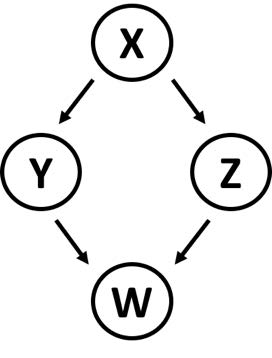
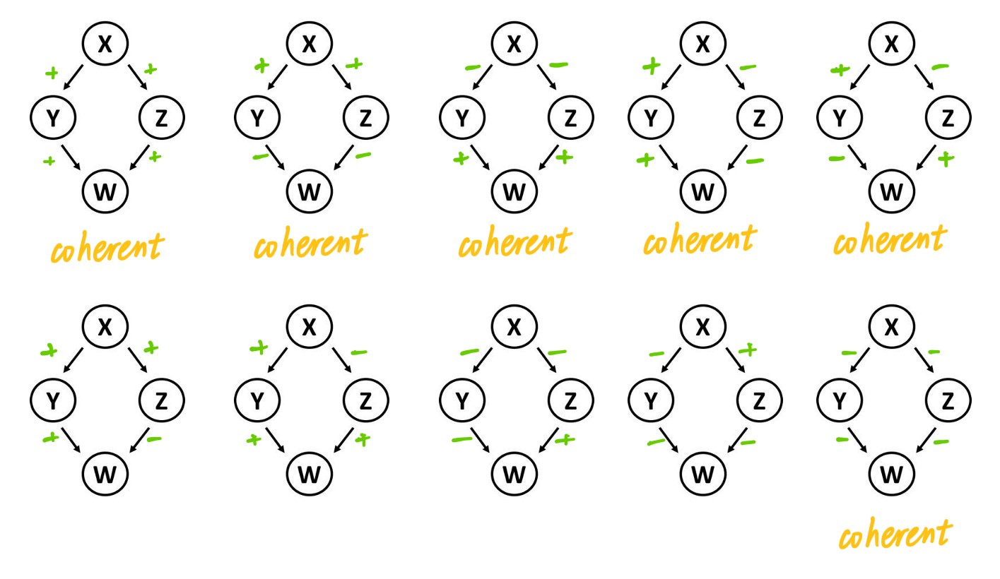
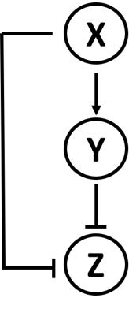
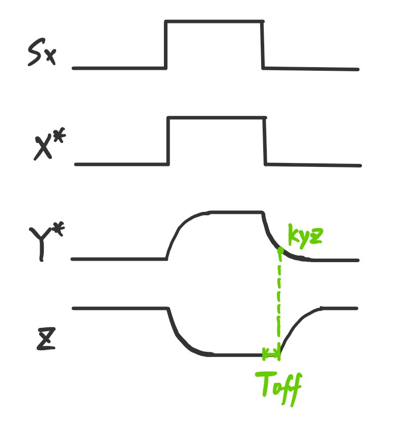
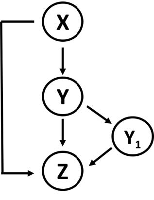
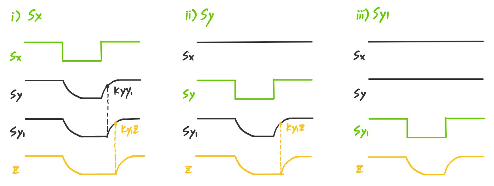
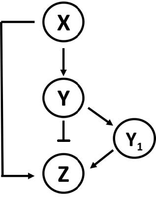
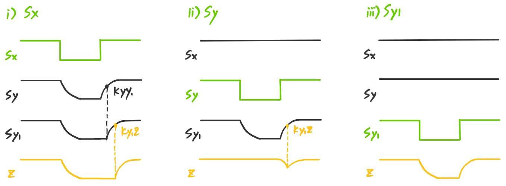

# 
Computational Systems Biology, Homework 3

王宇哲 2201112023

Academy for Advanced Interdisciplinary Studies, Peking University
# Feed-forward loop network motif

## 1.

The four-node diamond pattern occurs when X regulates Y and Z, and both Y and Z regulate gene W.

a) How does the mean number of diamonds scale with network size in random ER networks?

***Proof.*** For the 4-node diamond-pattern networks, we have the number of nodes $n=4$ and the number of edges $g=4$. The mean number of diamonds
$$
\langle N\rangle=\frac{1}{a}\lambda^gN^{n-g}=\frac{1}{a}\lambda^4
$$
is constant and thus is independent on the ER network size.

b) What are the distinct types of sign combinations of the diamond (where each edge is either activation “+” or repression “-”)? How many of these are coherent?

***Proof.*** There are 10 distinct types, 6 of which are coherent (Illustrated below).

c) Consider a diamond with four activation edges. Assign activation thresholds to all edges. Analyze the dynamics of W following a step of $S_x$, for both AND and OR logic at the W promoter. Are there sign-sensitive delays?

***Proof.*** For a diamond with four activation edges, we set

|      | production rate | degradation rate | steady state              | activation threshold |
| ---- | :-------------- | ---------------- | ------------------------- | -------------------- |
| Y    | $\beta_y$       | $\alpha_y$       | $y_{st}=\beta_y/\alpha_y$ | $k_{yw}$             |
| Z    | $\beta_z$       | $\alpha_z$       | $z_{st}=\beta_z/\alpha_z$ | $k_{zw}$             |

Assuming $k_{zw}\ll k_{yw}$, we have
$$
\begin{aligned}
({\rm For\,AND})\ \ T_{\rm on}^{(y)}&=\frac{1}{\alpha_y}\log{\frac{y_{st}}{y_{st}-k_{yw}}}\\
({\rm For \,OR})\ \ T_{\rm off}^{(y)}&=\frac{1}{\alpha_y}\log{\frac{y_{st}}{k_{yw}}}
\end{aligned}
$$
Similarly, assuming $k_{yw}\ll k_{zw}$, we have
$$
\begin{aligned}
({\rm For\,AND})\ \ T_{\rm on}^{(z)}&=\frac{1}{\alpha_z}\log{\frac{z_{st}}{z_{st}-k_{zw}}}\\
({\rm For \,OR})\ \ T_{\rm off}^{(z)}&=\frac{1}{\alpha_z}\log{\frac{z_{st}}{k_{zw}}}
\end{aligned}
$$
Hence, in general, for AND logic, we have
$$
\begin{aligned}
T_{\rm on}&=\max{(T_{\rm on}^{(y)}, T_{\rm on}^{(z)})}\\
T_{\rm off}&=\min{(T_{\rm off}^{(y)}, T_{\rm off}^{(z)})}
\end{aligned}
$$
for OR logic, we have
$$
\begin{aligned}
T_{\rm on}&=\min{(T_{\rm on}^{(y)}, T_{\rm on}^{(z)})}\\
T_{\rm off}&=\max{(T_{\rm off}^{(y)}, T_{\rm off}^{(z)})}
\end{aligned}
$$
There ARE sign-sensitive delays.

## 2.

Solve the dynamics of the Type-3 coherent FFL with AND logic at the Z promoter in response to steps of $S_x$. Here, AND logic means
that Z is produced if both $X^*$ and $Y^*$ do not bind the promoter. Are there delays? What is the steady-state logic carried out by this circuit? Compare to the other coherent FFL types.

***Proof.*** The dynamics of the Type-3 coherent FFL with AND logic is illustrated below. 

We can observe from above that there is delay in OFF process in the Type-3 coherent FFL. Suppose the degradation rate of Z is $\alpha_z$, the production rate when not inhibited is $\beta_z$, the basal production rate when inhibited is $\beta'_z$. The steady state of Z when not inhibited is
$$
z_{st}=\frac{\beta_z}{\alpha_z}
$$
The steady state of Z when inhibited is
$$
z'_{st}=\frac{\beta'_z}{\alpha_z}
$$
The delay $T_{\rm off}$ is calculated by
$$
T_{\rm off}=\frac{1}{\alpha_y}\log{\frac{y_{st}}{k_{yz}}}=\frac{1}{\alpha_y}\log{\frac{\beta_y}{\alpha_yk_{yz}}}
$$
where $\alpha_y$ and $\beta_y$ are the degradation rate and the production rate of Y, respectively. Type-3 coherent FFL is different from *e.g.* Type-1 coherent FFL with AND logic, the latter of which exhibits a delay in ON process. 

## 3.

Consider a coherent type-1 FFL with nodes X, Y, and Z, which is linked to another coherent type-1 FFL in which Y activates $Y_1$, which activates Z.

a) Sketch the dynamics of Z expression in response to steps of the signals $S_x$, $S_y$, and $S_{y1}$ (steps in which one of the signals goes ON or OFF in the presence of the other signals). Can the dynamics of the interconnected circuit be understood based on the qualitative behavior of each FFL in isolation?

***Proof.*** The dynamics of of Z expression in response to steps of the signals $S_x$, $S_y$, and $S_{y1}$ (suppose AND logic & steps of the signals only affect the downstream nodes in general) is illustrated below.

We can see that the qualitative behavior of each FFL in isolation can provide some insight into the dynamics of interconnected circuit, but is not sufficient to fully understand its properties. 

b) Repeat for the case where Y represses Z, so that the X, Y, Z FFL is an incoherent type-1 FFL. Assume that $Y_1$ binding to the Z promoter can alleviate the repressing effect of Y.

***Proof.*** The dynamics of of Z expression in response to steps of the signals $S_x$, $S_y$, and $S_{y1}$ is illustrated below.

