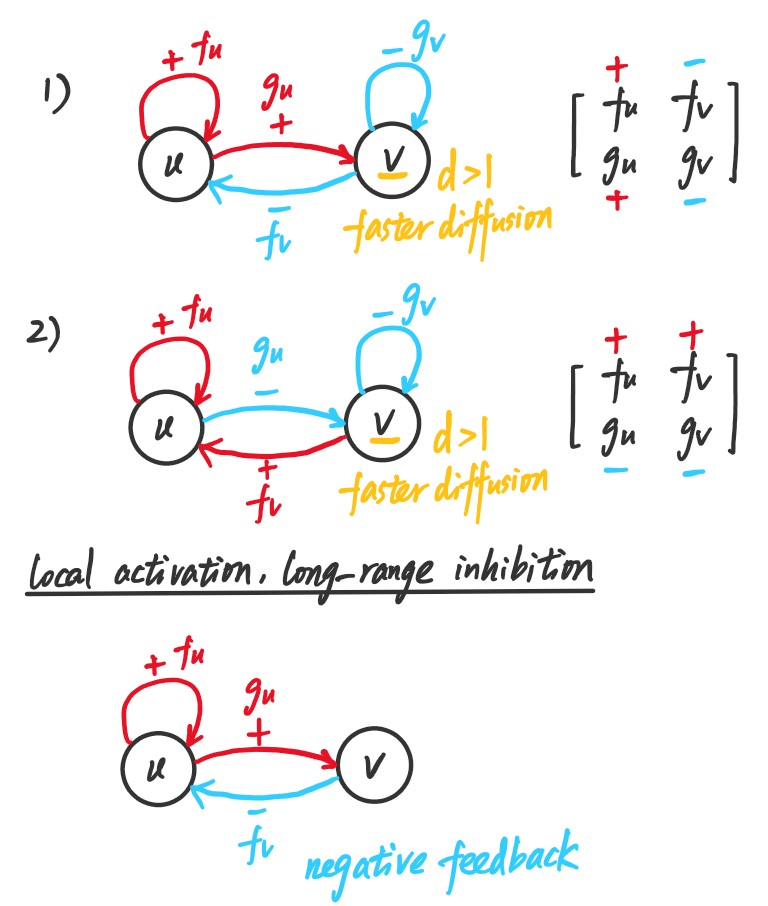
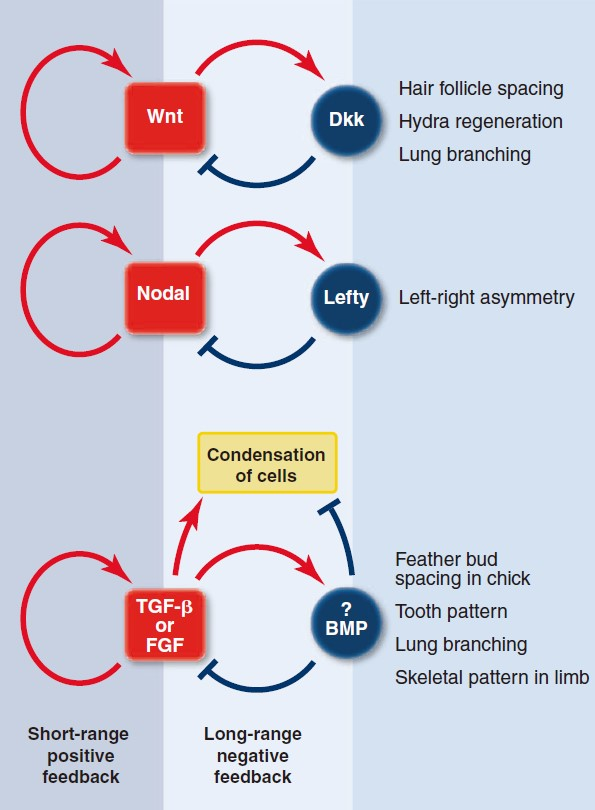
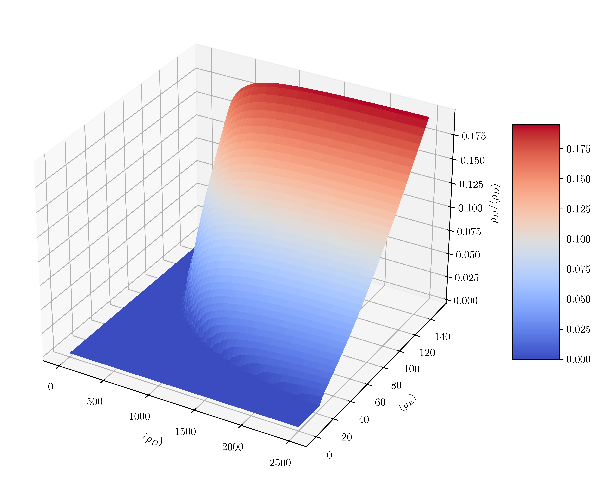
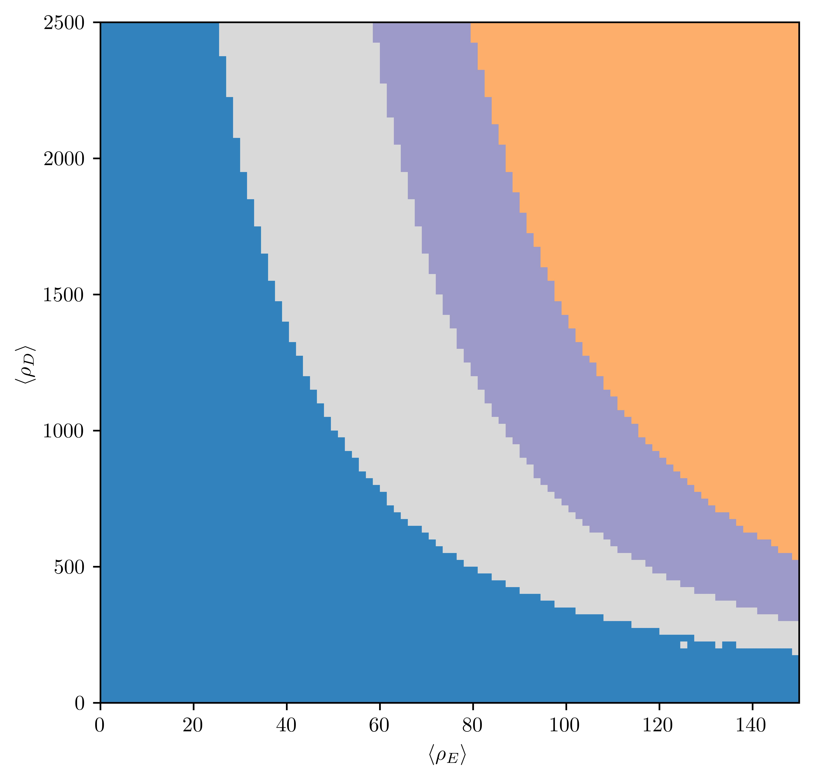

# <center>Computational Systems Biology, Homework 5
<center>王宇哲 2201112023
<center>Academy for Advanced Interdisciplinary Studies, Peking University

## 1. Stability of a reaction diffusion system

Consider the following general reaction diffusion system
$$
\begin{aligned}
\frac{\partial u}{\partial t}&=A_1 F(u,v)+D_1 \frac{\partial^2 u}{\partial x^2}\\
\frac{\partial v}{\partial t}&=A_2 G(u,v)+D_2 \frac{\partial^2 v}{\partial x^2}
\end{aligned}\tag{1}
$$

a. Show that by choosing units properly this system can be rewritten as
$$
\begin{aligned}
\frac{\partial \bar{u}}{\partial \bar{t}}&=\gamma F(u,v)+\frac{\partial^2 \bar{u}}{\partial \bar{x}^2}\equiv \gamma f(\bar{u},\bar{v})+\frac{\partial^2 \bar{u}}{\partial x^2}\\
\frac{\partial \bar{v}}{\partial \bar{t}}&=\gamma G(u,v)+d\frac{\partial^2 \bar{v}}{\partial \bar{x}^2}\equiv \gamma g(\bar{u},\bar{v})+d\frac{\partial^2 \bar{v}}{\partial x^2}
\end{aligned}\tag{2}
$$

***Proof.*** Let $t=A_1/\bar{t}$, $x=\sqrt{\frac{D_1}{A_1}}\bar{x}$, $u=A_1\bar{u}$, $v=A_1\bar{v}$, we have
$$
\begin{aligned}
\frac{\partial\bar{u}}{\partial\bar{t}}&=\frac{1}{A_1}F(u,v)+\frac{\partial^2\bar{u}}{\partial\bar{x}^2}\\
\frac{\partial\bar{v}}{\partial\bar{t}}&=\frac{1}{A_1}G(u,v)+\frac{D_2}{D_1}\frac{\partial^2\bar{v}}{\partial\bar{x}^2}
\end{aligned}\tag{3}
$$
we define $\gamma=1/A_1$, $d=D_2/D_1$, $F(u,v)=f(\bar{u},\bar{v})$, $G(u,v)=g(\bar{u}, \bar{v})$ to obtain (2).

From now on we will work with this system and we will drop the bars to simplify the notation. Assume $\gamma>0$.

b. Let’s first consider some homogeneous solution $u(x,t) = u_0$ and $v(x,t) = v_0$. Write, in terms of the derivatives of the functions $f$ and $g$, the conditions that will ensure the stability of this solution. From now on, assume that this solution is stable.

***Proof.*** Without spatial variation, the system (2) becomes
$$
\begin{aligned}
\frac{\partial u}{\partial t}&=\gamma f(u,v)\\
\frac{\partial v}{\partial t}&=\gamma g(u,v)
\end{aligned}\tag{4}
$$
the Jacobian matrix of the system (4) is given by
$$
A=\begin{pmatrix}
\frac{\partial f}{\partial u}&\frac{\partial f}{\partial v}\\
\frac{\partial g}{\partial u}&\frac{\partial g}{\partial v}
\end{pmatrix}\tag{5}
$$
the homogeneous solution $u(x,t)=u_0$, $v(x,t)=v_0$ is linearly stable if and only if
$$
\begin{aligned}
\text{Tr}(A)&=f_u+g_v<0\\
\det(A)&=f_ug_v-f_vg_u>0
\end{aligned}\tag{6}
$$


c. As done in class, now consider inhomogeneous perturbations of the form
$$
\begin{aligned}
u(x,t)&=u_0+\delta u(t)\cos{(x/l)}\\
v(x,t)&=v_0+\delta v(t)\cos{(x/l)}
\end{aligned}\tag{7}
$$
and, assuming $\delta u(t)$ and $\delta v(t)$ to be small, derive linear differential equations for $\delta u(t)$ and $\delta v(t)$.

***Proof.*** We substitute (7) into (2) and obtain
$$
\begin{aligned}
\frac{\partial\delta u}{\partial t}&=\frac{\gamma f(u_0,v_0)}{\cos(x/l)}-\frac{\delta u}{l^2}\\
\frac{\partial\delta v}{\partial t}&=\frac{\gamma g(u_0,v_0)}{\cos(x/l)}-\frac{d\delta v}{l^2}
\end{aligned}\tag{8}
$$

d. Show that in order for at least some of these perturbations to be unstable these conditions must hold:
$$
\begin{aligned}
df_u&+g_v>0\\
(df_u&+g_v)^2-4d(f_ug_v-f_vg_u)>0
\end{aligned}\tag{9}
$$
where, for instance, $f_u$ stands for the partial derivative of $f$ with respect to $u$ evaluated at $(u_0, v_0)$. Show that these conditions along with the ones derived in part b imply that the signs of $f_u$ and $g_v$ must be different. Additionally show that when we assume that $f_u > 0$ then $d > 1$.

***Proof.*** The Jacobian matrix of the system (8) is given by
$$
J=\begin{pmatrix}
\gamma f_u-\frac{1}{l^2}&\gamma f_v\\
\gamma g_u& \gamma g_v-\frac{d}{l^2}
\end{pmatrix}\tag{10}
$$
from (6) we have $f_u+g_v<0$, hence
$$
\begin{aligned}
\text{Tr}(J)&=\gamma(f_u+g_v)-\frac{1+d}{l^2}<0\\
\end{aligned}\tag{11}
$$
in order for at least some of these perturbations to be unstable, we have
$$
\det(J)=\gamma^2(f_ug_v-f_vg_u)-\frac{\gamma}{l^2}(df_u+g_v)+\frac{d}{l^4}<0\tag{12}
$$
for some $l\neq 0$. From (6) we have $f_ug_v-f_vg_u>0$, hence
$$
\begin{aligned}
df_u&+g_v>0
\end{aligned}\tag{13}
$$
and the discriminant $\Delta >0$ *i.e.*
$$
(df_u+g_v)^2-4d(f_ug_v-f_vg_u)>0\tag{14}
$$
hence the conditions in (9) hold. Additionally, consider that (combine (13) and (6))
$$
\begin{aligned}
df_u&+g_v>0\\
f_u&+g_v<0
\end{aligned}\tag{15}
$$
we can infer that $f_u$ and $g_v$ must have different signs. If $f_u>0$, then $g_v<0$, hence $d>1$.

e. What are the possible interaction structures compatible with a system that presents this kind of instability? (*i.e.*, How does each variable affect itself and the other near the fixed point? Inhibiting or enhancing production?) Compare these structures with the local-activation-long-range-inhibition picture. What does the condition $d > 1$ represent in each case?

***Proof.*** From (6) we have $f_ug_v-f_vg_u>0$. Consider that $f_ug_v<0$, we have
$$
f_vg_u<0\tag{16}
$$
*i.e.* $f_v$ and $g_u$ have different signs. Two possible interaction structures (and the local-activation-long-range-inhibition picture in comparison) are illustrated in the figure above. The condition $d>1$ indicates that $v$ has a faster diffusion rate than $u$.



f. Look up in the literature for two examples of pattern forming systems and compare the networks involved with the ones you derived in e.

***Proof.*** Examples of pattern forming systems are shown in the figure below (taken from Kondo, S., & Miura, T. (2010). Reaction-diffusion model as a framework for understanding biological pattern formation. *Science*, *329*(5999), 1616-1620.) 



These pattern forming systems are compatible with the local-activation-long-range-inhibition picture, and are relatively similar to the interaction structure 1 if self-inhibition of $v$ is omitted.

## 2. Turing patterns in 2D

We will consider the following dimensionless system restricted to a square region in 2D with a side of length $L$ and periodic boundary conditions.
$$
\begin{aligned}
\frac{\partial u}{\partial t}&=\gamma\Big(a-u-\frac{\rho uv}{1+u+Ku^2}\Big)+\nabla^2 u\\
\frac{\partial v}{\partial t}&=\gamma\Big(\alpha(b-v)-\frac{\rho uv}{1+u+Ku^2}\Big)+d\nabla^2 v
\end{aligned}\tag{17}
$$
where
$$
\nabla^2 f = \frac{\partial^2 f}{\partial x^2}+\frac{\partial^2 f}{\partial y^2}\tag{18}
$$
We will work with the parameters $d = 10$, $a = 92$, $b = 64$, $\alpha = 1.5$, $\rho = 18.5$, $K = 0.1$ and we will try to study how the behavior changes as $\gamma$ is varied.

a. Show that by choosing length and time units properly a system in which the length of the square is $L'$ can be thought as a system in which $L = 1$ but with a different value of $\gamma$. So, we can think that by changing $\gamma$ we are effectively studying systems of different sizes.

***Proof.*** Let $x=\bar{x}L'$, $y=\bar{y}L'$, $t=\bar{t}L'^2$, $u=\bar{u}$, $v=\bar{v}$, we have
$$
\begin{aligned}
\frac{1}{L'^2}\frac{\partial\bar{u}}{\partial\bar{t}}&=\gamma\Big(a-\bar{u}-\frac{\rho\bar{u}\bar{v}}{1+\bar{u}+K\bar{u}^2}\Big)+\frac{1}{L'^2}\Big(\frac{\partial^2\bar{u}}{\partial\bar{x}^2}+\frac{\partial^2\bar{u}}{\partial\bar{y}^2}\Big)\\
\frac{1}{L'^2}\frac{\partial\bar{v}}{\partial\bar{t}}&=\gamma\Big(\alpha(b-\bar{v})-\frac{\rho\bar{u}\bar{v}}{1+\bar{u}+K\bar{u}^2}\Big)+\frac{d}{L'^2}\Big(\frac{\partial^2\bar{v}}{\partial\bar{x}^2}+\frac{\partial^2\bar{v}}{\partial\bar{y}^2}\Big)
\end{aligned}\tag{19}
$$
We compare (19) with (17) and let
$$
\bar{\gamma}=\gamma L'^2\tag{20}
$$
so that a system in which the length of the square is $L'$ can be thought as a system in which $L = 1$ but with a different value of $\gamma$.

b. Compute the homogeneous stationary solutions $u_0$ and $v_0$ numerically.

***Proof.*** The homogeneous stationary solutions $u_0$ and $v_0$ satisfy
$$
\begin{aligned}
&a-u_0-\frac{\rho u_0v_0}{1+u_0+Ku_0^2}=0\\
&\alpha(b-v_0)-\frac{\rho u_0v_0}{1+u_0+Ku_0^2}=0
\end{aligned}\tag{21}
$$
We solve (21) numerically with the Python code below.


```python
from scipy.optimize import fsolve
import numpy as np

# Parameters
d = 10
a = 92
b = 64
alpha = 1.5
rho = 18.5
K = 0.1

# Define the equations
def equations(vars):
    u0, v0 = vars
    eq1 = a - u0 - (rho * u0 * v0) / (1 + u0 + K * u0**2)
    eq2 = alpha * (b - v0) - (rho * u0 * v0) / (1 + u0 + K * u0**2)
    return [eq1, eq2]

# Solve the equations
u0_guess = 1
v0_guess = 1

u0_sol, v0_sol = fsolve(equations, (u0_guess, v0_guess))

print("The solutions are u0 = ", u0_sol, "and v0 = ", v0_sol)
```

    The solutions are u0 =  9.933832843779085 and v0 =  9.289221895852718


Hence the homogeneous stationary solutions are $u_0=9.9338$, $v_0=9.2892$.

c. Show that for the given parameter values the system in unstable to some inhomogeneous perturbations.

***Proof.*** Consider some inhomogeneous perturbations
$$
\boldsymbol{w}=
\begin{pmatrix}
u-u_0\\
v-v_0
\end{pmatrix}\tag{22}
$$
and linearize (17) around $(u_0,v_0)$ to obtain
$$
\boldsymbol{w}_t=\gamma\boldsymbol{A}\boldsymbol{w}+\boldsymbol{D}\nabla^2\boldsymbol{w}\tag{23}
$$
where
$$
\begin{aligned}
\boldsymbol{A}&=
\begin{pmatrix}
f_u&f_v\\
g_u&g_v
\end{pmatrix}_{u_0,v_0}\\
&=
\begin{pmatrix}
-\frac{\rho v}{1+u+Ku^2}+\frac{\rho u v(2Ku+1)}{(1+u+Ku^2)^2}-1&-\frac{\rho u}{1+u+Ku^2}\\
\frac{\rho v(Ku^2-1)}{(1+u+Ku^2)^2}&-\alpha-\frac{\rho u}{1+u+Ku^2}
\end{pmatrix}_{u_0,v_0}\\
&=
\begin{pmatrix}
2.5219&−8.8346\\
3.5219&-10.3346
\end{pmatrix}\end{aligned}\tag{24}
$$
and
$$
\boldsymbol{D}=
\begin{pmatrix}
1&0\\
0&d
\end{pmatrix}=
\begin{pmatrix}
1&0\\
0&10
\end{pmatrix}
\tag{25}
$$
let $\boldsymbol{w}_k(\boldsymbol{z},t)$ be the eigenfunction of (23) corresponding to the wavenumber $k$, we look for solutions $\boldsymbol{w}(\boldsymbol{z},t)$ of the form
$$
\boldsymbol{w}(\boldsymbol{z},t)=\sum_kc_ke^{\lambda t}\boldsymbol{w}_k(\boldsymbol{z})\tag{26}
$$
where $\boldsymbol{z}=(x,y)$, $\lambda_k$ is the eigenvalue which determines temporal growth. Substituting (26) into (23), we obtain
$$
\lambda \boldsymbol{w}_k=\gamma\boldsymbol{A}\boldsymbol{w}_k-\boldsymbol{D}k^2\boldsymbol{w}_k\tag{27}
$$
$\lambda$ are determined by the roots of the characteristic polynomial
$$
\det(\lambda\boldsymbol{I}-\gamma\boldsymbol{A}+\boldsymbol{D}k^2)=0\tag{28}
$$
which gives
$$
\begin{aligned}
&\lambda^2+\lambda\Big(k^2(1+d)-\gamma(f_u+g_v)\Big)+h(k^2)=0\\
\text{where}\ \ &h(k^2)=dk^4-\gamma(df_u+g_v)k^2+\gamma^2\det(\boldsymbol{A})
\end{aligned}\tag{29}
$$
from (24) we have $f_u+g_v<0$, hence $k^2(1+d)-\gamma(f_u+g_v)>0$. Consider that
$$
h_{\min}=\gamma^2\Big(\det(\boldsymbol{A})-\frac{(df_u+g_v)^2}{4d}\Big)=-0.4868\gamma^2<0\tag{30}
$$
hence there exists $k$ such that $h(k^2)<0$ and thus $\text{Re}\lambda<0$, which means that the system is unstable to some inhomogeneous perturbations.

d. What are the unstable wave vectors or wave lengths? Your answer will depend on $\gamma$.

***Proof.*** We solve $h(k^2)=0$ to obtain $k_1^2=0.5236\gamma$, $k_2^2=0.9649\gamma$. Hence the unstable wave vectors satisfy
$$
0.5236\gamma<k^2<0.9649\gamma\tag{31}
$$

e. Now we will study the system numerically using an explicit first order Euler scheme for approximating the solution of the partial differential equations. For pure diffusion this scheme involves discretizing
$$
\begin{aligned}
\frac{\partial u}{\partial t}=D\Big(\frac{\partial^2 u}{\partial x^2}+\frac{\partial^2 u}{\partial y^2}\Big)
\end{aligned}\tag{32}
$$
into
$$
\frac{u_{n+1,m_x,m_y}-u_{n,m_x,m_y}}{\Delta t}=D\Big(\frac{u_{n,m_x+1,m_y}+u_{n,m_x-1,m_y}-2u_{n,m_x,m_y}}{\Delta l^2}+\frac{u_{n,m_x,m_y+1}+u_{n,m_x,m_y-1}-2u_{n,m_x,m_y}}{\Delta l^2}\Big)\tag{33}
$$
where we have set
$$
u(n\Delta t,m_x\Delta l,m_y\Delta l)=u_{n,m_x,m_y}\tag{34}
$$
Propose a solution of the form 
$$
u_{n,m_x,m_y}=\xi^n e^{i(m_xk_x+m_yk_y)\Delta l}\tag{35}
$$
and compute $\xi$ in terms of $k_x$, $k_y$, $\Delta t$ and $\Delta l$. What condition on $\xi$ will ensure that the method is numerically stable? Show that in order to get numerical stability you need
$$
\Delta t < \frac{\Delta l^2}{4D}\tag{36}
$$
How would you generalize this condition to the case when you have two species with different diffusion coefficients?

***Proof.*** Substituting (35) into (33) gives
$$
\xi=1+\frac{2D\Delta t}{\Delta l^2}\Big(\cos{k_x\Delta l}+\cos{k_y\Delta l}-2\Big)\tag{37}
$$
which is numerically stable if $|\xi|< 1$. Consider that $|\cos{k_x\Delta l}+\cos{k_y\Delta l}|\leq 2$, we have
$$
\Delta t < \frac{\Delta l^2}{4D}\tag{38}
$$
If we have two species with different diffusion coefficients $D_1$, $D_2$, then the condition for numerical stability is
$$
\Delta t < \frac{\Delta l^2}{4\max(D_1,D_2)}\tag{39}
$$

f. Simulate the system for different values of $\gamma$ and study whether patterns form or not. You can start by trying $\gamma = 0,\, 10,\, 100,\, 1000$. Let the system evolve till you are convinced that it has reached a stationary behavior. What kind of patterns do you get? Do you always get patterns? Why? Note: These simulations will take some time to run; plan ahead.

***Proof.*** We use the following code to simulate the system for different values of $\gamma$. Notice that from (39) we have $\Delta t<\Delta l^2/40$.


```python
import numpy as np
import matplotlib.pyplot as plt
from matplotlib import cm

# Parameters
a = 92
b = 64
alpha = 1.5
rho = 18.5
K = 0.1
d = 10

# Grid size
Nx = 100
Ny = 100
Nt = 100000

# Grid spacing
dx = 1.0 / Nx
dy = 1.0 / Ny
dt = 1e-6

def run_simulation(gamma=1):
    """
    Run the simulation for a given value of gamma
    """
    # Initialize u and v
    u = np.random.rand(Nx, Ny)
    v = np.random.rand(Nx, Ny)

    # Time stepping
    for n in range(Nt):
        # Compute spatial derivatives with periodic boundary conditions
        u_xx = (np.roll(u, -1, axis=0) - 2*u + np.roll(u, 1, axis=0)) / dx**2
        u_yy = (np.roll(u, -1, axis=1) - 2*u + np.roll(u, 1, axis=1)) / dy**2
        v_xx = (np.roll(v, -1, axis=0) - 2*v + np.roll(v, 1, axis=0)) / dx**2
        v_yy = (np.roll(v, -1, axis=1) - 2*v + np.roll(v, 1, axis=1)) / dy**2

        # Update u and v
        u += dt * (gamma * (a - u - rho*u*v / (1 + u + K*u**2)) + u_xx + u_yy)
        v += dt * (gamma * (alpha*(b - v) - rho*u*v / (1 + u + K*u**2)) + d * (v_xx + v_yy))

    return u, v

# Plot the results
fig, axes = plt.subplots(3, 3)
plt.rcParams.update({
    "text.usetex": True
})

for i, gamma in enumerate([0, 10, 100, 500, 1000, 2000, 5000, 10000, 20000]):
    u, v = run_simulation(gamma)
    ax = axes[i//3, i%3]

    vis = ax.imshow(u, cmap=cm.coolwarm)
    fig.colorbar(vis, ax=ax, shrink=0.7)

    ax.set_xticks([])
    ax.set_yticks([])
    ax.set_title(f'$\\gamma = {gamma}$')

fig.set_size_inches(18, 16)
plt.savefig('2-f.jpg', dpi=1000, bbox_inches='tight')
plt.show()
```


## 3. Spatial oscillations in E. coli – Howard *et al.* model

Consider the Howard model (Phys. Rev. Lett. 87 (27), 278102 (2001).) for the spatial oscillations of the proteins that control the positioning of the midcell division plane
$$
\begin{aligned}
\frac{\partial \rho_D}{\partial t}&=-\frac{\sigma_1\rho_D}{1+\sigma'_1\rho_e}+\sigma_2\rho_e\rho_d+D_D\frac{\partial^2\rho_D}{\partial x^2}\\
\frac{\partial \rho_d}{\partial t}&=\frac{\sigma_1\rho_D}{1+\sigma'_1\rho_e}-\sigma_2\rho_e\rho_d\\
\frac{\partial \rho_E}{\partial t}&=\frac{\sigma_4\rho_e}{1+\sigma'_4\rho_D}-\sigma_3\rho_D\rho_E+D_E\frac{\partial^2\rho_E}{\partial x^2}\\
\frac{\partial\rho_e}{\partial t}&=-\frac{\sigma_4\rho_e}{1+\sigma'_4\rho_D}+\sigma_3\rho_D\rho_E
\end{aligned}\tag{40}
$$
In these equations $\rho_D$ represents the linear number density of MinD in the cytoplasm, $\rho_d$ the density of MinD bound to the membrane and $\rho_E$ and $\rho_e$ are the analogous quantities for MinE. We will consider this system in a finite 1D region of length $L$ with no-flux boundary conditions on the end points, *i.e.* for every density $\rho$ at any given time, on the end points we have
$$
\frac{\partial \rho}{\partial x}\Big|_{t,x=\text{end point}}=0\tag{41}
$$
We will use this set of parameters: $\sigma_1=20\,{\rm s^{-1}}$, $\sigma'_1=0.028\,{\rm \mu m}$, $\sigma_2=0.0063\,{\rm \mu m/s}$, $\sigma_3=0.04\,{\rm \mu m/s}$, $\sigma_4=0.8\,{\rm s^{-1}}$, $\sigma'_4=0.027\,{\rm \mu m}$, $D_D=0.28\,{\rm \mu m^2/s}$, $D_E=0.6\,{\rm \mu m^2/s}$, $L=2\,{\rm \mu m}$.

a. Give a biological interpretation for every term in the equations.

***Proof.*** Biological interpretation for each term in (40) is as follows:

|  Term   | Interpretation  |
|  :-:  | -  |
| $\frac{\partial\rho_D}{\partial t}$  | Changing rate of the density of MinD in the cytoplasm with respect to time  |
| $\frac{\partial\rho_d}{\partial t}$  | Changing rate of the density of MinD bound to the membrane with respect to time |
| $\frac{\partial\rho_E}{\partial t}$  | Changing rate of the density of MinE in the cytoplasm with respect to time  |
| $\frac{\partial\rho_e}{\partial t}$  | Changing rate of the density of MinE bound to the membrane with respect to time |
| $\frac{\sigma_1\rho_D}{1+\sigma'_1\rho_e}$ | Association of MinD to the membrane|
| $\sigma_2\rho_e\rho_d$ | Dissociation of MinD from the membrane into the cytoplasm |
| $D_D\frac{\partial^2\rho_D}{\partial x^2}$ | Diffusion of MinD in the cytoplasm along the membrane|
| $\frac{\sigma_4\rho_e}{1+\sigma'_4\rho_D}$ | Dissociation of MinE from the membrane into the cytoplasm|
| $\sigma_3\rho_D\rho_E$ | Association of MinE to the membrane |
| $D_E\frac{\partial^2\rho_E}{\partial x^2}$ | Diffusion of MinE in the cytoplasm along the membrane|

b. Show that the total amount of MinD and MinE are conserved quantities. We will consider the average densities of MinD and MinE, which equal these total conserved amounts divided by $L$, as two other parameters of the system; we will call them $\langle\rho_D\rangle$ and $\langle\rho_E\rangle$. They do not explicitly appear in the set of equations above, so, how do they enter the model? Based on the literature, give estimates for the order of magnitude of these two quantities.

***Proof.*** From (40) we have
$$
\frac{\partial\rho_D}{\partial t}+\frac{\partial\rho_d}{\partial t}=D_D\frac{\partial^2\rho_D}{\partial x^2}\tag{42}
$$
we integrate (42) over the region $[0,L]$ to obtain the changing rate of the total amount of MinD, which is 
$$
\begin{aligned}
\frac{d}{dt}\int_0^L(\rho_D+\rho_d)dx&=D_D\frac{d}{dt}\int_0^L\frac{\partial^2\rho_D}{\partial x^2}dx\\
&=D_D\frac{d}{dt}\Big(\frac{\partial\rho_D}{\partial t}\Big)\Big|_{0}^{L}\\
&=0
\end{aligned}\tag{43}
$$
the last equality is due to the no-flux boundary conditions (41). Similarly, we have
$$
\frac{d}{dt}\int_0^L(\rho_E+\rho_e)dx=0\tag{44}
$$
hence the total amount of MinD and MinE are conserved quantities.

By definition, we have
$$
\begin{aligned}
\langle\rho_D\rangle&=\frac{1}{L}\int_0^L(\rho_D+\rho_d)dx\\
\langle\rho_E\rangle&=\frac{1}{L}\int_0^L(\rho_E+\rho_e)dx
\end{aligned}
\tag{45}
$$
$\langle\rho_D\rangle$ and $\langle\rho_E\rangle$ can enter the model via solving for homogeneous steady-state solutions (see for details in (c)). Based on the literature (Howard, M., Rutenberg, A. D., & de Vet, S. (2001).  Dynamic compartmentalization of bacteria: accurate division in E. coli. *Physical review letters*, *87*(27), 278102.), we have $\langle\rho_D\rangle\sim 1500\,{\rm \mu m^{-1}}$, $\langle\rho_E\rangle\sim 85\,{\rm \mu m^{-1}}$.

c. Under what conditions is the trivial solution $\rho_D=0$, $\rho_d=\langle\rho_D\rangle$, $\rho_E=\langle\rho_E\rangle$, $\rho_e=0$ unstable to homogeneous perturbations?

***Proof.*** We consider homogeneous perturbations $\delta\rho_D$, $\delta\rho_d$, $\delta\rho_E$, $\delta\rho_e$ to the steady state solution and linearize the resulting system of equations around the steady state. 
$$
\begin{aligned}
\frac{\partial \delta\rho_D}{\partial t}&=-\frac{\partial \delta\rho_d}{\partial t}=-\sigma_1\delta\rho_D+\sigma_2\langle\rho_D\rangle\delta\rho_e\\
\frac{\partial\delta\rho_e}{\partial t}&=-\frac{\partial \delta\rho_E}{\partial t}=-\sigma_4\delta\rho_e+\sigma_3\langle\rho_E\rangle\delta\rho_D
\end{aligned}\tag{46}
$$
the Jacobian matrix of (46) is given by (set $\delta \rho_D$ and $\delta \rho_e$ the variables)
$$
A=\begin{pmatrix}
-\sigma_1&\sigma_2\langle\rho_D\rangle\\
\sigma_3\langle\rho_E\rangle&-\sigma_4
\end{pmatrix}\tag{47}
$$
to enable the trivial solution $\rho_D=0$, $\rho_d=\langle\rho_D\rangle$, $\rho_E=\langle\rho_E\rangle$, $\rho_e=0$ unstable to homogeneous perturbations, consider that
$$
\text{Tr}(A)=-\sigma_1-\sigma_4<0\tag{48}
$$
we need to have
$$
\det(A)=\sigma_1\sigma_4-\sigma_2\sigma_3\langle\rho_D\rangle\langle\rho_E\rangle
<0\tag{49}
$$
which gives
$$
\langle\rho_D\rangle\langle\rho_E\rangle>\frac{\sigma_1\sigma_4}{\sigma_2\sigma_3}=6.3492\times 10^{4}\tag{50}
$$

d. Write a system of equations for computing the homogeneous steady state solutions and write some MATLAB code for computing nontrivial homogeneous steady state solutions numerically (when they exist). Plot the nontrivial stable homogeneous steady state relative density of MinD in the cytoplasm ($\equiv \rho_D /\langle\rho_D\rangle$) as a function of $\langle\rho_D\rangle$ and $\langle\rho_E\rangle$ in the range $\langle\rho_D\rangle\in [0,2500]\,{\rm \mu m^{-1}}$, $\langle\rho_E\rangle\in [0,150]\,{\rm \mu m^{-1}}$. You might find the MATLAB commands ```surf```, ```mesh```, ```pcolor``` or similar ones, useful for the plotting.

***Proof.*** The homogeneous steady state solutions are given by
$$
\begin{aligned}
-\frac{\sigma_1\rho_D}{1+\sigma'_1\rho_e}&+\sigma_2\rho_e\rho_d = 0\\
-\frac{\sigma_4\rho_e}{1+\sigma'_4\rho_D}&+\sigma_3\rho_D\rho_E = 0\\
\rho_D&+\rho_d=\langle\rho_D\rangle\\
\rho_E&+\rho_e=\langle\rho_E\rangle
\end{aligned}\tag{51}
$$
We solve (51) numerically and visualize the nontrivial homogeneous steady state solutions with the Python code below.


```python
from scipy.optimize import fsolve
import matplotlib.pyplot as plt
from matplotlib import cm
import numpy as np
import warnings


def equations(vars, *params):
    rho_D, rho_E = vars
    rho_D_bar, rho_E_bar = params

    rho_d = rho_D_bar - rho_D
    rho_e = rho_E_bar - rho_E

    sigma1, sigma1_prime, sigma2, sigma3, sigma4, sigma4_prime = 20, 0.028, 0.0063, 0.04, 0.8, 0.027
    
    eq1 = -sigma1*rho_D/(1+sigma1_prime*rho_e) + sigma2*rho_e*rho_d
    eq2 = -sigma4*rho_e/(1+sigma4_prime*rho_D) + sigma3*rho_D*rho_E
    
    return [eq1, eq2]


def solve_rho_D(rho_D_bar, rho_E_bar):
    """
    Solve the system of equations for a given set of parameters
    """
    initial_guesses = [(np.random.uniform(1, rho_D_bar), np.random.uniform(1, rho_E_bar)) for _ in range(100)]
    solutions = [fsolve(equations, guess, args=(rho_D_bar, rho_E_bar)) for guess in initial_guesses]
    
    solutions = [sol[0] for sol in solutions if (sol[0]>0.1 and sol[1]>0.1)]
    solutions.sort(reverse=True)

    if len(solutions) == 0:
        return 0
    else:
        return '%.4f' % (solutions[0]/rho_D_bar)


warnings.filterwarnings("ignore")

rho_D_bars = np.linspace(0, 2500, 100)
rho_E_bars = np.linspace(0, 150, 100)

rho_Ds = np.empty((len(rho_D_bars), len(rho_E_bars)))
for i, rho_D_bar in enumerate(rho_D_bars):
    for j, rho_E_bar in enumerate(rho_E_bars):
        rho_Ds[i, j] = solve_rho_D(rho_D_bar, rho_E_bar)


fig, ax = plt.subplots(subplot_kw={"projection": "3d"})
plt.rcParams.update({
    "text.usetex": True
})

Rho_D_bars, Rho_E_bars = np.meshgrid(rho_D_bars, rho_E_bars)
surf = ax.plot_surface(Rho_D_bars, Rho_E_bars, rho_Ds.T, cmap=cm.coolwarm, linewidth=0, antialiased=False)
ax.set_xlabel('$\\langle\\rho_D\\rangle$')
ax.set_ylabel('$\\langle\\rho_E\\rangle$')
ax.set_zlabel('$\\rho_D /\\langle\\rho_D\\rangle$')

fig.set_size_inches(12, 8)
fig.colorbar(surf, shrink=0.5, aspect=5)
plt.savefig('3-d.jpg', dpi=1000, bbox_inches='tight')
plt.show()
```




e. Set your coordinate system so that the endpoints of the region of interest are at $x = \pm L/2$ and consider an arbitrary small perturbation around the homogenous steady state of the form $\rho_i=\rho_{i,hss}+\delta\rho_i\cos{(kx)}$. What are the possible values of $k$ compatible with the boundary conditions of the problem? How does your answer change if you consider perturbations of the form $\rho_i=\rho_{i,hss}+\delta\rho_i\sin{(kx)}$. (The subindex hss stands for homogenous steady state)

***Proof.*** For perturbations of the form $\rho_i=\rho_{i,hss}+\delta\rho_i\cos{(kx)}$, the boundary conditions (41) give
$$
\begin{aligned}
-k\sin(-kL/2)&=0\\
-k\sin(kL/2)&=0
\end{aligned}\tag{52}
$$
which gives
$$
k=\frac{2n\pi}{L},\,n\in\mathbb{Z}\tag{53}
$$
If we consider perturbations of the form $\rho_i=\rho_{i,hss}+\delta\rho_i\sin{(kx)}$, similarly we have
$$
k=\frac{(2n+1)\pi}{L},\,n\in\mathbb{Z}\tag{54}
$$

f. Write code that will compute the eigenvalues of the system when disturbed from equilibrium with a perturbation of wave vector $k$. Plot the real and imaginary part of the eigenvalues as a function of $k$ for these two cases:

(i). $\langle\rho_D\rangle=1000\,{\rm \mu m^{-1}}$, $\langle\rho_E\rangle=75\,{\rm \mu m^{-1}}$.

(ii). $\langle\rho_D\rangle=2000\,{\rm \mu m^{-1}}$, $\langle\rho_E\rangle=125\,{\rm \mu m^{-1}}$.

***Proof.*** The Jacobian matrix of the system of (40) is given by:
$$
A=\begin{pmatrix}
-\frac{\sigma_1}{1 + \sigma'_1\rho_e} & \sigma_2\rho_e & 0 & \frac{\sigma_1\rho_D\sigma'_1}{(1 + \sigma'_1\rho_e)^2} + \sigma_2\rho_d \\
\frac{\sigma_1}{1 + \sigma'_1\rho_e} & -\sigma_2\rho_e & 0 & -\frac{\sigma_1\rho_D\sigma'_1}{(1 + \sigma'_1\rho_e)^2} - \sigma_2\rho_d \\
-\sigma_3\rho_E - \frac{\sigma_4\rho_e\sigma'_4}{(1 + \sigma'_4\rho_D)^2} & 0 & -\sigma_3\rho_D & \frac{\sigma_4}{1 + \sigma'_4\rho_D} \\
\sigma_3\rho_E + \frac{\sigma_4\rho_e\sigma'_4}{(1 + \sigma'_4\rho_D)^2} & 0 & \sigma_3\rho_D & -\frac{\sigma_4}{1 + \sigma'_4\rho_D}
\end{pmatrix}\tag{55}
$$
we define
$$
D=\begin{pmatrix}
D_D&0&0&0\\
0&0&0&0\\
0&0&D_E&0\\
0&0&0&0
\end{pmatrix}\tag{56}
$$
and solve the eigenvalue problem
$$
|\lambda I-A+Dk^2|=0\tag{57}
$$
to obtain the eigenvalues $\lambda$ (*i.e.* the eigenvalues of the matrix $A-Dk^2$) as a function of $k$. Python implementation is given below.


```python
import numpy as np
import matplotlib.pyplot as plt

sigma1, sigma1_prime, sigma2, sigma3, sigma4, sigma4_prime = 20, 0.028, 0.0063, 0.04, 0.8, 0.027
D_D, D_E = 0.28, 0.6


def solve_system(rho_D_bar, rho_E_bar, rand_num=100):
    """
    Solve the system of equations for a given set of parameters
    """
    initial_guesses = [(np.random.uniform(1, rho_D_bar), np.random.uniform(1, rho_E_bar)) for _ in range(rand_num)]
    solutions = [fsolve(equations, guess, args=(rho_D_bar, rho_E_bar)) for guess in initial_guesses]
    
    solutions = [sol for sol in solutions if (sol[0]>0.1 and sol[1]>0.1)]
    solutions.sort(key=lambda x: x[0], reverse=True)

    if len(solutions) == 0:
        return 0, 0
    else:
        return solutions[0][0], solutions[0][1]


def solve_eigenvalue(k, rho_D_bar, rho_E_bar, rho_D=None, rho_E=None):
    if rho_D is None or rho_E is None:
        rho_D, rho_E = solve_system(rho_D_bar, rho_E_bar)
    rho_d = rho_D_bar - rho_D
    rho_e = rho_E_bar - rho_E

    Mat_A = np.array([[-sigma1/(rho_e*sigma1_prime + 1), rho_e*sigma2, 0, rho_D*sigma1*sigma1_prime/(rho_e*sigma1_prime + 1)**2 + rho_d*sigma2], 
                      [sigma1/(rho_e*sigma1_prime + 1), -rho_e*sigma2, 0, -rho_D*sigma1*sigma1_prime/(rho_e*sigma1_prime + 1)**2 - rho_d*sigma2], 
                      [-rho_E*sigma3 - rho_e*sigma4*sigma4_prime/(rho_D*sigma4_prime + 1)**2, 0, -rho_D*sigma3, sigma4/(rho_D*sigma4_prime + 1)], 
                      [rho_E*sigma3 + rho_e*sigma4*sigma4_prime/(rho_D*sigma4_prime + 1)**2, 0, rho_D*sigma3, -sigma4/(rho_D*sigma4_prime + 1)]])
    Mat_D = np.array([[D_D, 0, 0, 0], 
                      [0, 0, 0, 0], 
                      [0, 0, D_E, 0], 
                      [0, 0, 0, 0]])
    
    eigenvalues = np.linalg.eigvals(Mat_A - k**2*Mat_D)

    return eigenvalues


fig, ((ax1, ax2), (ax3, ax4)) = plt.subplots(2, 2)
plt.rcParams.update({
    "text.usetex": True
})

k_arr = np.linspace(-10, 10, 150)

for k in k_arr:
    ax1.scatter(k*np.ones(4), solve_eigenvalue(k, 1000, 75).real, color='tab:blue', s=2)
    ax2.scatter(k*np.ones(4), solve_eigenvalue(k, 1000, 75).imag, color='tab:orange', s=2)
    ax3.scatter(k*np.ones(4), solve_eigenvalue(k, 2000, 125).real, color='tab:blue', s=2)
    ax4.scatter(k*np.ones(4), solve_eigenvalue(k, 2000, 125).imag, color='tab:orange', s=2)

for ax, case, part in zip([ax1, ax2, ax3, ax4], [1, 1, 2, 2], ['real', 'imaginary', 'real', 'imaginary']):
    ax.set_title('Case ' + str(case) + ', ' + part + ' part')
    ax.set_xlabel('$k$')
    ax.set_ylabel('$\\lambda$')

fig.set_size_inches(12, 12)
plt.savefig('3-f.jpg', dpi=1000, bbox_inches='tight')
plt.show()
```


g. Divide the parameter space $\langle\rho_D\rangle\in[0,2500]\,{\rm \mu m^{-1}}$, $\langle\rho_E\rangle\in[0,150]\,{\rm \mu m^{-1}}$ in $100\times 100$ points and for each combination of parameters decide whether the nontrivial homogeneous solution is stable or not against inhomogeneous perturbations. If it is unstable, is the imaginary part of the unstable eigenvalues zero? Use this information to construct a phase diagram in which you identify regions for which the system exhibits different qualitative behaviors.

***Proof.*** We construct the phase diagram with the Python code below.


```python
import numpy as np
import matplotlib.pyplot as plt
from matplotlib import cm

rho_D_bars = np.linspace(0, 2500, 100)
rho_E_bars = np.linspace(0, 150, 100)

params_type = np.empty((len(rho_D_bars), len(rho_E_bars)))

for i, rho_D_bar in enumerate(rho_D_bars):
    for j, rho_E_bar in enumerate(rho_E_bars):
        rho_D, rho_E = solve_system(rho_D_bar, rho_E_bar, rand_num=500)

        if (rho_D, rho_E) == (0, 0):
            params_type[i, j] = 0 # nontrivial solution doesn't exist

        else:
            eigen_real, eigen_imag = [], []

            for k in np.linspace(-10, 10, 100):
                eigenvalues = solve_eigenvalue(k, rho_D_bar, rho_E_bar, rho_D=rho_D, rho_E=rho_E)
                eigen_real.append(eigenvalues.real)
                eigen_imag.append(eigenvalues.imag)

            eigen_real, eigen_imag = np.array(eigen_real), np.array(eigen_imag)

            if np.all(eigen_real <= 0):
                params_type[i, j] = 1 # stable nontrivial solution
            
            elif np.any((np.where(eigen_real > 0, 1, 0) * np.where(eigen_imag != 0, 1, 0)) == 1):
                params_type[i, j] = 2 # there exists unstable nontrivial solution with non-zero imaginary part
                if np.any((np.where(eigen_real > 0, 1, 0) * np.where(eigen_imag == 0, 1, 0)) == 1):
                    params_type[i, j] = 3 # there also exists unstable nontrivial solution with zero imaginary part
            else:
                params_type[i, j] = 4 # unstable nontrivial solution with zero imaginary part 


fig, ax = plt.subplots()
plt.rcParams.update({
    "text.usetex": True
})

ax.imshow(np.flip(params_type, axis=0), extent=[0, 150, 0, 2500], cmap=cm.tab20c, aspect='auto', interpolation='nearest')
ax.set_xlabel('$\\langle\\rho_E\\rangle$')
ax.set_ylabel('$\\langle\\rho_D\\rangle$')
fig.set_size_inches(6, 6)
plt.savefig('3-g.jpg', dpi=1000, bbox_inches='tight')
plt.show()
```




The distinct regions in the phase diagram are:
| Phase | Color   | Nontrivial Solution  |Stable Nontrivial Solution  | Unstable Nontrivial Solution, Non-zero Imaginary Part of the Unstable Eigenvalues | Unstable Nontrivial Solution, Zero Imaginary Part of the Unstable Eigenvalues | 
| :-: | :-: | :-:  | :-:| :-:| :-:|
|  1  |  Blue |   | | |  |
| 2 |  Gray |  √ | |√ | √ |
| 3 |  Lavender  |  √  | |√ |  |
| 4 | Orange  |   √  | √ | |  |

h. Write some code to simulate the system for some combinations of parameters in the distinct regions you found in h. How do you have to choose $\Delta t$ in order to avoid numerical instabilities? Use inhomogeneous initial conditions in order to test the system against this kind of perturbations. For each simulation show space-time plots of $\rho_D/\langle\rho_D\rangle$ for a period of time of at least $200\, {\rm s}$ once a regular behavior is established. These simulations might take some time to run, so plan in advance!

***Proof.*** Similar to (39) in problem 2-e, we have
$$
\Delta t<\frac{\Delta l^2}{4\max{(D_D,D_E)}}\tag{58}
$$
to avoid numerical instabilities. We simulate the system with the Python code below. 


```python
import numpy as np
import matplotlib.pyplot as plt
from matplotlib import cm
from mpl_toolkits.mplot3d import Axes3D

# Parameters
sigma1, sigma1_prime, sigma2, sigma3, sigma4, sigma4_prime = 20, 0.028, 0.0063, 0.04, 0.8, 0.027
D_D, D_E = 0.28, 0.6
L = 2

# Grid size
Nx = 100
Nt = 4000000

# Grid spacing
dx = L / Nx
dt = 1e-4

# Time steps to store for plotting
plot_steps = 1000


def run_simulation(rho_D_bar, rho_E_bar):
    """
    Run the simulation with given parameters
    """
    # Initialization
    rho_D = np.random.rand(Nx)*rho_D_bar
    rho_E = np.random.rand(Nx)*rho_E_bar
    rho_d = rho_D_bar - rho_D
    rho_e = rho_E_bar - rho_E

    rho_D_plot = []

    # Time stepping
    for n in range(Nt):
        # Compute spatial derivatives
        rho_D_xx = (np.roll(rho_D, -1) - 2*rho_D + np.roll(rho_D, 1)) / dx**2
        rho_E_xx = (np.roll(rho_E, -1) - 2*rho_E + np.roll(rho_E, 1)) / dx**2

        # Apply no-flux boundary conditions
        rho_D_xx[0] = (rho_D[1] - rho_D[0]) / dx**2
        rho_D_xx[-1] = (rho_D[-2] - rho_D[-1]) / dx**2
        rho_E_xx[0] = (rho_E[1] - rho_E[0]) / dx**2
        rho_E_xx[-1] = (rho_E[-2] - rho_E[-1]) / dx**2

        # Update
        rho_D += dt * (-sigma1*rho_D/(1+sigma1_prime*rho_e) + sigma2*rho_e*rho_d + D_D * rho_D_xx)
        rho_d += dt * (sigma1*rho_D/(1+sigma1_prime*rho_e) - sigma2*rho_e*rho_d)
        rho_E += dt * (sigma4*rho_e/(1+sigma4_prime*rho_D) - sigma3*rho_D*rho_E + D_E * rho_E_xx)
        rho_e += dt * (-sigma4*rho_e/(1+sigma4_prime*rho_D) + sigma3*rho_D*rho_E)

        if n > Nt/2 and n % plot_steps == 0:
            rho_D_plot.append(rho_D.copy()/rho_D_bar)

    return np.array(rho_D_plot)

# Plot the results
fig, axes = plt.subplots(2, 2, subplot_kw={"projection": "3d"})
plt.rcParams.update({
    "text.usetex": True
})

# Create a grid of x and t values
x = np.linspace(-L/2, L/2, Nx)
t = np.linspace(Nt*dt/2, Nt*dt, len(rho_D_plot))
T, X = np.meshgrid(t, x)

save_rho_D_list = []

for i, (rho_D_bar, rho_E_bar) in enumerate(zip([500, 1500, 1500, 2000], [20, 60, 85, 120])):
    rho_D_plot = run_simulation(rho_D_bar, rho_E_bar)
    save_rho_D_list.append(rho_D_plot.copy())
    ax = axes[i//2, i%2]

    ax.plot_wireframe(T, X, rho_D_plot.T)
    ax.set_xlabel('$t/{\\rm s}$')
    ax.set_ylabel('$x/{\\rm \\mu m}$')
    ax.set_zlabel('$\\rho_D/\\langle\\rho_D\\rangle$')
    ax.set_title(f'Space-time Plot, Phase {i+1}', fontsize=20)

fig.set_size_inches(18, 16)
plt.savefig('3-h.jpg', dpi=1000, bbox_inches='tight')
plt.show()
```


The simulation results are shown in the figure above. Periodic oscillations can be observed under Phase 2 with time period of $\sim 100\,{\rm s}$.
